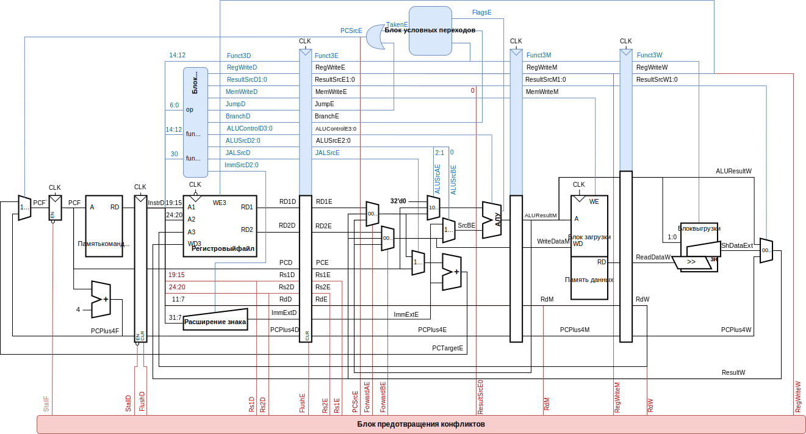

#### Структура процессора

#### Таблица истинности основного дешифратора
|Команда|  op   |RegWrite|ImmSrc|AluSrc|MemWrite|ResultSrc|Branch|ALUOp|Jump|JALSrc|
|-------|:-----:|:------:|:----:|:----:|:------:|:-------:|:----:|:---:|:--:|:----:|
| lw    |0000011| 1      | 000  | 001  | 0      | 01      | 0    | 00  | 0  | 0    |
| sw    |0100011| 0      | 001  | 001  | 1      | 00      | 0    | 00  | 0  | 0    |
| тип R |0110011| 1      | 000  | 000  | 0      | 00      | 0    | 10  | 0  | 0    |
| тип B |1100011| 0      | 010  | 000  | 0      | 00      | 1    | 01  | 0  | 0    |
| тип I |0010011| 1      | 000  | 001  | 0      | 00      | 0    | 10  | 0  | 0    |
| jal   |1101111| 1      | 011  | 000  | 0      | 10      | 0    | 00  | 1  | 0    |
| jalr  |1100111| 1      | 000  | 000  | 0      | 10      | 0    | 00  | 1  | 1    |
| auipc |0010111| 1      | 100  | 011  | 0      | 00      | 0    | 00  | 0  | 0    |
| lui   |0110111| 1      | 100  | 101  | 0      | 00      | 0    | 00  | 0  | 0    |

#### Таблица истинности дешифратора АЛУ
| ALUOp |funct3|{op5,funct75}| ALUControl               | Команда                 |
|:-----:|:----:|:---------------------------------:|--------------------------|:-----------------------:|
| 00    | x    | xx                                |0000 (сложение)           |lw, sw, lui, auipc       |
| 01    | x    | xx                                |0001 (вычитание)          |beq,bne,blt,bge,bltu,bgeu|
| 10    | 000  | 00,01,10                          |0000 (сложение)           |add, addi                |
| 10    | 000  | 11                                |0001 (вычитание)          |sub                      |
| 10    | 001  | xx                                |0110 (лог. сдвиг влево)   |sll, slli                |
| 10    | 010  | xx                                |0101 (если меньше)        |slt, slti                |
| 10    | 011  | xx                                |1001 (если меньше б/зн)   |sltu, sltiu              |
| 10    | 100  | xx                                |0100 (искл. "или")        |xor, xori                |
| 10    | 101  | x0                                |0111 (лог. сдвиг вправо)  |srl, srli                |
| 10    | 101  | x1                                |1000 (арифм. сдвиг вправо)|sra, srai                |
| 10    | 110  | xx                                |0011 (побитовое "или")    |or, ori                  |
| 10    | 111  | xx                                |0010 (побитовое "и")      |and, andi                |

#### Кодировка знакового расширения непосредственного числа
|ImmSrc| ImmExt                                                        |Тип| Описание                    |
|:----:|---------------------------------------------------------------|:-:|:---------------------------:|
| 000  |<code>{{20{Imm[31]}},Imm[31:20]}</code>                        | I |12-битная константа со знаком|
| 001  |<code>{{20{Imm[31]}},Imm[31:25],Imm[11:7]}</code>              | S |12-битная константа со знаком|
| 010  |<code>{{20{Imm[31]}},Imm[7],Imm[30:25],Imm[11:8],1'b0}</code>  | B |13-битная константа со знаком|
| 011  |<code>{{12{Imm[31]}},Imm[19:12],Imm[20],Imm[30:21],1'b0}</code>| J |21-битная константа со знаком|
| 100  |<code>{Imm[31:12],{12{1'b0}}}</code>                           | U |20-битная константа без знака|

#### Управляющие сигналы АЛУ
|ALUControl| Операция | Описание                         |
|:--------:|:--------:|----------------------------------|
| 0000     | +        |ADD  - Сложение                   |
| 0001     | -        |SUB  - Вычитание                  |
| 0010     | &        |AND  - Побитовое "И"              |
| 0011     | \|       |OR   - Побитовое "ИЛИ"            |
| 0100     | ^        |XOR  - Исключающее "ИЛИ"          |
| 0101     | <        |SLT  - Меньше                     |
| 0110     | <<       |SLL  - Логический сдвиг влево     |
| 0111     | >>       |SRL  - Логический сдвиг вправо    |
| 1000     | >>>      |SRA  - Арифметический сдвиг вправо|
| 1001     | < (б/зн) |SLTU - Беззнаковое меньше         |

#### Логика блока условных переходов
Флаги, поступающие с АЛУ:
- v - Overflow (Переполнение);
- с - Carry out (Перенос);
- n - Negative (Отрицательный результат);
- z - Zero (Нулевой результат);

|funct3| Условие  | Тип условного перехода                                |
|:----:|:--------:|-------------------------------------------------------|
| 000  |z         |BEQ  - Переход если равно                              |
| 001  |~z        |BNE  - Переход если не равно                           |
| 100  |n XOR v   |BLT  - Переход если меньше                             |
| 101  |~(n XOR v)|BGE  - Переход если больше или равно                   |
| 110  |~с        |BLTU - Переход если меньше(беззнаковые числа)          |
| 111  |с         |BGEU - Переход если больше или равно(беззнаковые числа)|

#### Поддерживаемые целочисленные инструкций RISC-V (RV32I)
| Команда | Описание                            |&check;/&cross;|
|---------|-------------------------------------|:-------------:|
| LUI     | Load Upper Immediate                | &check;       |
| AUIPC   | Add Upper Immediate to PC           | &check;       |
| JAL     | Jump and Link                       | &check;       |
| JALR    | Jump and Link Register              | &check;       |
| BEQ     | Branch if Equal                     | &check;       |
| BNE     | Branch if Not Equal                 | &check;       |
| BLT     | Branch if Less Than                 | &check;       |
| BGE     | Branch if Greater or Equal          | &check;       |
| BLTU    | Branch if Less Than Unsigned        | &check;       |
| BGEU    | Branch if Greater or Equal Unsigned | &check;       |
| LB      | Load Byte                           | &check;       |
| LH      | Load Half                           | &check;       |
| LW      | Load Word                           | &check;       |
| LBU     | Load Byte Unsigned                  | &check;       |
| LHU     | Load Half Unsigned                  | &check;       |
| SB      | Store Byte                          | &check;       |
| SH      | Store Half                          | &check;       |
| SW      | Store Word                          | &check;       |
| ADD     | Add                                 | &check;       |
| ADDI    | Add Immediate                       | &check;       |
| SUB     | Subtract                            | &check;       |
| SLL     | Shift Left Logical                  | &check;       |
| SLLI    | Shift Left Logical Immediate        | &check;       |
| SLT     | Set Less Than                       | &check;       |
| SLTI    | Set Less Than Immediate             | &check;       |
| SLTU    | Set Less Than Unsigned              | &check;       |
| SLTIU   | Set Less Than Unsigned Immediate    | &check;       |
| XOR     | Exclusive OR                        | &check;       |
| XORI    | Exclusive OR Immediate              | &check;       |
| SRL     | Shift Right Logical                 | &check;       |
| SRLI    | Shift Right Logical Immediate       | &check;       |
| SRA     | Shift Right Arithmetic              | &check;       |
| SRAI    | Shift Right Arithmetic Immediate    | &check;       |
| OR      | OR                                  | &check;       |
| ORI     | OR Immediate                        | &check;       |
| AND     | AND                                 | &check;       |
| ANDI    | AND Immediate                       | &check;       |

#### Замечания
1. Для штатной работы однотактного ядра (SINGLECYCLE_CORE) необходима асинхронная память инструкций и данных, которая может быть получена при варианте синтезируемой на ячейках памяти(SYNTH_MEM). В таком режиме ядро практически полностью является комбинационным и может работать на общей частоте тактирования (clk), одна инструкция выполняется за один такт. Если же использовать внутреннюю память плис (BSRAM_MEM), которая является синхронной, то ядро становистя псевдо однотактным поскольку данные записываются и считываются из памяти по переднему фронту тактового сигнала и для одной инструкции необходимо уже 3 такта. Первый такт приходит на тактирования всех узлов ядра, кроме памяти инструкций, которая тактируется от второго такта, и памяти данных, которая тактируется от третьего такта. Думаю что реализвация однотактного ядра с синхронной памятью возможна при 2 тактах, необходима !дополнительная проработка!
2. При использовании памяти BSRAM в конвеерном ядре межстадийным регистром является сама память поскольку она явлется синхронной и выдаёт данные на выход по такту. При использовании синтезированной памяти в конвеерном ядре нужен дополнительный межстадийный регистр поскольку память асинхронная и необходимо разделить стадии регистрами. Для однотактного ядра межстадийный регистр не нужен, связь явлется проводником.
3. Связано с пунктом 2. При разработке приостановки конвейера, всвязи с конфликтом при выполнении инструкции lw, необходимо задержать межстадийный регистр (fetch-decode) на один такт. Поскольку в конвейерном ядре с памятью BSRAM межстадийным регистром является сама память приходится отключать тактирование памяти на 1 такт подачей сигнала imem_re на контакт ce (clock enable) BSRAM. В текущей конфигурации кода появилось очень длинная связь именно логическая, сложная для понимания, но не нарушающая и не ухудшающая параметры ядра. Возможно пересмотреть.
4. Не очень нравится как реализованы интерфейсы мамяти в ядре. Может лучше достать их из модулей стадий конвейера и поместить в главный модуль core. Подумать.
5. Можно сократить одну операцию в модуле АЛУ, если объединить вместе операции арифметического и логического сдвига с предварительной подготовкой знакового бита, согласно следующему выражению:  <code>3'b111: ALUResult = $signed({($sra | $srai) ? srcA[31] : 1'b0, srcA}) >>> srcB[4:0];</code>  В таком случае также можно будет уменьшить разрядность ALUControl до 3ёх, но потребуется дополнительные флаги о том что выполняется команда sra или srai.
6. Упёрся в частоту при синтезировании однотактного ядра на этапе добавления блока загрузки/выгрузки (LSU). Частота процессора 27MHz. А в проблемной конфигурации (однотактное ядро с синтезированной памятью) частота ещё в 3 раза ниже. Можно немного немного уменьшить временные задержки, если сделать несколько параллельных цепей расширения знака. Возможно это повлияет на работу конвейерного ядра при увеличении частоты, необходимо обратить на это внимание в дальнейшем.
7. Адресация синтезированной памяти обрезана до 15 бит, чтобы обрезать адрес глобального выбора области памяти/периферии. Память обрезается по аналогии с максимально возможной памятью 32кБайта для BSRAM, синтезированная память конечно не может позволить себе таких размеров.