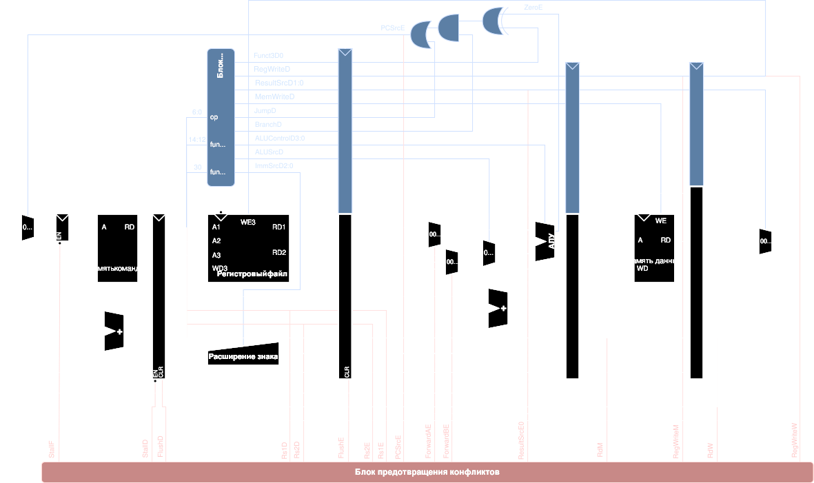

Архитектура askoRV32
====================

Описание устройства процессора askoRV32: из каких блоков он состоит, как они связаны и что умеет. Подробности отдельных узлов — в профильных документах:
- прерывания и CSR — [interrupts.md](interrupts.md);
- отладчик — [debug.md](debug.md);
- частота, ресурсы и журнал оптимизации — [performance_roadmap.md](performance_roadmap.md);
- тесты — [hw/sim/README.md](../sim/README.md);
- CoreMark — [hw/sim/bench/README.md](../sim/bench/README.md).

Изменения функционала заносятся в раздел «[Журнал изменений функционала](#журнал-изменений-функционала)» в конце файла. Изменения, которые меняют только частоту или ресурсы, — в журнал оптимизации.

Состояние на 2026-09-29 (ветка `AI_Help`).

## Кратко

| | |
|---|---|
| Набор команд | RV32IM + Zicsr, машинный режим (M-mode) |
| Ядро | конвейерное, 6 стадий (F-D-E-M-W-X); однотактное — как эталон (`CORE_TYPE`) |
| ПЛИС | GOWIN GW1NR-LV9 (плата Tang Nano 9K) и GW2A-LV18 (Tang Primer 20K, ПЛИС реального проекта) — две платформы одного проекта, [hw/boards/README.md](../boards/README.md) |
| Такт ядра | 45 МГц от rPLL (однотактное ядро с BSRAM — 15 МГц) |
| Fmax конвейера | 48.1–49.5 МГц (GW1NR-9), 65.6 МГц (GW2A-18, первая сборка) |
| Производительность | 2.448 CoreMark/МГц, 110 CoreMark на 45 МГц |
| Память | IMEM и DMEM — BSRAM по 8/16/32 кБайт или синтезированная (раздельные шины, гарвардская схема) |
| Прерывания | CLINT (MSI, MTI), PLIC (MEI, 8 источников, векторный режим: у каждого источника свой вход таблицы векторов), 16 локальных линий (LI0 — таймер STIM), векторный `mtvec` |
| Отладка | RISC-V Debug 0.13 через JTAG ПЛИС: останов, шаг, точки останова `ebreak`, регистры, CSR, доступ к памяти |
| Загрузка программы | из BSRAM битового потока или (блок SPIFLASH) из внешней SPI-флеш: аппаратный загрузчик копирует образ в IMEM/DMEM до старта ядра |
| Ресурсы (конвейер, BSRAM, с отладчиком) | 4656 LUT, 1758 триггеров, 1 MULT36X36 (2 из 10 DSP) — с периферией платы по `fw/boards/tangnano9k/tangnano9k.gwsoc` на 2026-09-30 (GPIO 14 линий, STIM) |

## Уровни и файлы

| Уровень | Файл | Что содержит | Кто правит |
|---|---|---|---|
| процессор | `hw/src/cpu.sv` | всё, без чего система не работает: тактирование (rPLL), сброс, ядро, отладчик JTAG, IMEM, DMEM, CLINT, PLIC, системная шина с портом пользовательской периферии `bus_per` | вручную |
| плата | `hw/boards/<плата>/top.sv` | выводы ПЛИС, переопределение параметров `cpu` (ядро, память, такт), шина пользовательской периферии на порту `bus_per`, сами устройства и их прерывания | генератор `sw/socgen` из `fw/boards/<плата>/<плата>.gwsoc` — не править |

Раскладка исходников:

| Папка | Что там |
|---|---|
| `hw/src/` | `cpu.sv`, `core.sv` (ядро), `mdu.sv` (умножение и деление), `mem.sv` (IMEM/DMEM), `clock.sv`, `top.sv` |
| `hw/src/sys/` | системные устройства процессора: `mux.sv` (`memmux`), `clint.sv`, `plic.sv` |
| `hw/src/debug/` | отладчик: DTM, DM, обёртка JTAG |
| `hw/src/periph/` | пользовательская периферия: шаблон `periph_regs.sv`, общая часть тестов `periph_tb.svh`; устройство — папка с модулем, тестом `tb_*.sv` и `README.md` ([periph/README.md](../src/periph/README.md)) |

**Тесты разделены** так, чтобы конфигурация платы не влияла на тесты ядра:
- **тесты ядра** (`py hw/sim/run_tests.py`) моделируют `cpu.sv` без `top.sv`. Прерывание LI0 и источник 1 PLIC для тестов даёт таймер тестбенча на порту `bus_per`, [hw/sim/README.md](../sim/README.md);
- **тесты периферии** (`py hw/sim/run_periph_tests.py`) — у каждого устройства свой, через шину регистров, без ядра.

## Параметры процессора

Значения по умолчанию заданы в `cpu.sv`. `top.sv` переопределяет их по конфигурации платы (`fw/boards/<плата>/<плата>.gwsoc`).

| Параметр | По умолчанию | Назначение |
|---|---|---|
| `CORE_TYPE` | `PIPELINE_CORE` (0) | 0 — конвейер, 1 — однотактное ядро |
| `M_EXT` | 1 | расширение M; при 0 команды `mul`/`div`/`rem` вызывают «недопустимую инструкцию», `misa` без бита M |
| `DIV_BPC` | 2 | бит частного за такт: 1, 2 или 4; деление — 32/`DIV_BPC` + 3 такта |
| `RF_TYPE` | 0 | регистровый файл: 0 — распределённая память (LUT, SSRAM); два блока BSRAM (SDPB), только у конвейера: 2 — чтение по спаду в середине D (`core.rfType = "bsram"`), 1 — чтение на фронте D → E (`"bsram-edge"`, для сравнения); поведение для программы одинаковое (см. «Конвейер») |
| `IMEM_TYPE`, `DMEM_TYPE` | `BSRAM_MEM` (1) | BSRAM или синтезированная память |
| `BSRAM_IMEM_SIZE`, `BSRAM_DMEM_SIZE` | 8 | кБайт: 8, 16 или 32 (вместе не больше 48) |
| `SYNTH_IMEM_SIZE`, `SYNTH_DMEM_SIZE` | 256 | слов синтезированной памяти |
| `IMEM_INIT_FILE`, `DMEM_INIT_FILE` | `mem_init/i.mem`, `d.mem` | начальное содержимое памяти |
| `DEBUG_EN` | 1 | модуль отладки по JTAG; несовместим с анализатором GAO |
| `PLIC_SOURCES` | 8 | число источников PLIC (1…31) |
| `FCLKIN`, `PLL_IDIV_SEL`, `PLL_FBDIV_SEL`, `PLL_ODIV_SEL` | "27", 2, 4, 16 | такт ядра FCLKIN × (FBDIV+1) / (IDIV+1) = 45 МГц; VCO 720 МГц |

## Структура



*Схема упрощённая и отстаёт от кода: на ней нет стадии X, расширения M, блока ловушек и отладчика.*

```
          IMEM (BSRAM)                           DMEM (BSRAM)       периферия
              │                                       │                 │
   ┌──F──┐ ┌──D──┐ ┌──E──────────────┐ ┌──M──────┐ ┌──W───────┐ ┌──X──┐  │
   │ PC  │→│дешиф│→│ АЛУ, сравнение  │→│ memmux  │→│выравнив. │→│ рег.│  │
   │     │ │рег. │ │ trap_unit (CSR, │ │ умнож.  │ │данных    │ │файл │  │
   │     │ │файл │ │ ловушки, отлад.)│ │ (DSP)   │ │загрузки  │ │     │  │
   │     │ │BTFN │ │ делитель        │ │         │ │          │ │     │  │
   └─────┘ └─────┘ └─────────────────┘ └─────────┘ └──────────┘ └─────┘
      ▲       ▲  байпас: M, W, X → E (коды выбора считаются в D)   │
      └───────┴──────── смена PC: переход из D (BTFN), из E (на такт позже)
```

### Конвейер

| Стадия | Что делает |
|---|---|
| **F** | PC, выборка команды из IMEM (BSRAM выдаёт команду по фронту, её регистр — выход памяти) |
| **D** | дешифрация; чтение регистрового файла (`RF_TYPE = 0`: распределённая память SSRAM, чтение асинхронное; `RF_TYPE = 2`: адреса rs1/rs2 защёлкиваются в BSRAM по спаду в середине D, выход блоков с байпасом записи — в регистры операндов на фронте D → E, как у LUT; `RF_TYPE = 1`: адреса защёлкиваются на фронте D → E, выход блоков — операнды стадии E); предсказание BTFN: `jal` и переходы назад выполняются сразу, по отдельному сумматору `PCTargetD`. Здесь же заранее считаются one-hot-коды для стадии E: байпас (`FwdA/FwdB/SelA`), выбор результата АЛУ (`ALUSel`), номер CSR (`CsrSel`), вид условия перехода (`BrKind/BrInv`) |
| **E** | АЛУ (один сдвигатель, сумматор); отдельная схема сравнения для переходов; решение о смене PC защёлкивается (`PCSrcM`) и применяется тактом позже; `trap_unit` — CSR, исключения, прерывания, вход в отладку; делитель (`mdu_div`) держит стадию E на время деления |
| **M** | обращение к шине данных (`memmux`); умножение на DSP (операнды защёлкнуты на границе E/M); результаты умножения и деления выбираются для стадии W (`rd_wf`) |
| **W** | данные загрузки из BSRAM: выравнивание и знаковое расширение (`writeback`) |
| **X** | запись в регистровый файл (`ResultX`) и байпас из X |

**Задержки** (такты сверх одного на инструкцию):

| Событие | Штраф |
|---|---|
| зависимость от загрузки | 2 такта сразу за загрузкой, 1 — через одну (данные доступны только из стадии X) |
| переход, выполненный из D (BTFN) | 1 |
| ошибка предсказания (выполненный переход вперёд, невыполненный назад), `jalr` | 3 |
| ловушка, `mret`, вход в отладку, продолжение | 4 (адрес ловушки — через регистр `RedirectPC_q`, мера П1) |
| зависимость от `mul` | 1 (результат — из стадии W) |
| `div`, `rem` | 32/`DIV_BPC` + 3 (19 при `DIV_BPC = 2`); прерывание посреди деления сбрасывает его, после `mret` деление повторяется |

Разбор CPI на CoreMark — в начале [performance_roadmap.md](performance_roadmap.md#откуда-берутся-потери).

**Однотактное ядро** (`CORE_TYPE = 1`) делит такт PLL на 3 (`divideby3`): PC, чтение команды, обращение к данным. Регистры стадий в нём прозрачны. Оно служит эталоном для сверки трасс и тестов, анализ времени для него не описан.

### Расширение M

- **Умножение** (`mdu_mul`): одно умножение 33 × 33 со знаком даёт `mul`, `mulh`, `mulhsu`, `mulhu`. Синтезатор собирает его из одного MULT36X36.
- **Деление** (`mdu_div`): шаг без восстановления остатка (по модулю И. Ряскина, г. Миасс), `DIV_BPC` шагов за такт. Особые случаи — по спецификации RISC-V, без ловушек:
  - деление на 0: частное — все единицы, остаток — делимое;
  - переполнение `−2^31 / −1`: частное `−2^31`, остаток 0.
- Выбор решений разобран в журнале оптимизации, шаги 15 и 18. Там же — сравнение с CORE-V Wally.

### CSR, ловушки, прерывания

- CSR: `mstatus`, `misa`, `mie`, `mip`, `mtvec` (прямой и векторный режим), `mscratch`, `mepc`, `mcause`, `mtval`, `mcycle[h]` (он же `mtime` CLINT), `cycle[h]`, `time[h]`, `dcsr`, `dpc`. Остальные читаются как 0.
- Исключения: недопустимая инструкция, `ecall`, `ebreak`, невыровненный адрес перехода, загрузки и записи.
- Прерывания и их приоритет: MEI > MSI > MTI > LI0…LI15.

Подробно — [interrupts.md](interrupts.md).

### Отладка

- DTM на пользовательских регистрах JTAG ПЛИС: ER1 — `dtmcs`, ER2 — `dmi`.
- DM: абстрактная команда Access Register (x0…x31 и CSR), System Bus Access к IMEM и шине данных.
- Отладчик делит с ядром порты регистрового файла. При регистровом файле на BSRAM значение регистра готово через такт после адреса — DM и так ждёт 2 такта (`REG_WAIT2`).
- Проверен на платах Tang Nano 9K и Tang Primer 20K (в том числе с регистровым файлом на BSRAM: запись и чтение регистров, x0, шаг).

Подробно — [debug.md](debug.md).

## Карта памяти

| Адрес | Устройство | Модуль |
|---|---|---|
| `0x0000_0000` | IMEM (своя шина команд; отладчик пишет в неё через System Bus) | `mem.sv`, в `cpu.sv` |
| `0x0200_0000` | CLINT: `msip`, `mtimecmp`, `mtime` (= `mcycle`) | `sys/clint.sv`, в `cpu.sv` |
| `0x0C00_0000` | PLIC | `sys/plic.sv`, в `cpu.sv` |
| `0x1000_0000` | DMEM | `mem.sv`, в `cpu.sv` |
| `0x1100_0000`…`0x1FFF_FFFF` | порт пользовательской периферии `bus_per` | `top.sv` |
| `0x1100_0000` | GPIO (светодиоды, выводы платы) — по умолчанию, адрес задаёт конфигуратор | `periph/gpio/` |
| `0x1200_0000` | TM1638 (плата индикации) — по умолчанию | `periph/tm1638/` |
| `0x1300_0000` | таймер STIM (16 бит, прерывание — источник 1 PLIC) — по умолчанию | `periph/stim/` |
| `0x1400_0000` | UART (FIFO, прерывание — источник 2 PLIC; выводы 17/18 — UART программатора BL702) — по умолчанию | `periph/uart/` |
| `0x1500_0000` | SPIFLASH: внешняя SPI-флеш (выводы 59–62, U3 на плате) и загрузчик программы — по умолчанию | `periph/spiflash/` |
| `0x1700_0000` | ADC: каналы АЦП ADC121S051 со смещения k · 0x40 — канал V (плата ADC_V, напряжение), канал C (ADC_C, ток); прерывание — источник PLIC 3 (ветки `fw_rect`, `hw_rect`) | `periph/adc121/` |
| `0x1800_0000` | RECT: выпрямитель — SIFU (+0x00), регулятор напряжения PI_U (+0x40), тока PI_I (+0x80); обратные связи — каналы ADC; прерывание — источник PLIC 2 (ветка `hw_rect`) | `periph/rect/` |
| `0x1600_0000` | SIFU: СИФУ трёхфазного мостового тиристорного выпрямителя (входы платы синхронизации NSB, выходы VS1…VS6; прерывание — источник PLIC по порядку блоков, в проекте 3) — по умолчанию | `periph/sifu/` |
| `0x1F00_0000` | устройства тестбенча: TOHOST, консоль, источники PLIC, таймер для тестов прерываний — только в моделировании | `hw/sim/tb_core.sv` |

Раскладка программы — `fw/GW1NR9.lds`: `.text` в IMEM, `.data` и `.rodata` — в DMEM. Адрес загрузки `.data` (LMA) — `0x8000`, за пределами IMEM, поэтому через отладчик программа загружается командой `restore`, а не `load` ([debug.md](debug.md)).

## Шина данных и периферии

**Решение (2026-09-30): синхронная шина регистров без подтверждения.** Нынешняя шина (`memmux`, `sys/mux.sv`) остаётся и оформляется как стандарт для всех устройств, в том числе кастомных. Шины с рукопожатием (APB, AHB, Wishbone, AXI) внутрь не вводятся, а подключаются мостами, только когда появится конкретное устройство, которому они нужны. Разбор, почему так, — ниже.

### Правила шины регистров

Ведущий — стадия M ядра или System Bus отладчика в режиме останова.

Шина двухуровневая:
- **системная — в `cpu.sv`:** `memmux` выбирает DMEM, CLINT, PLIC и порт пользовательской периферии `bus_per` — окно `0x1xxx_xxxx` (проверка старших 4 бит). В окно попадает и DMEM, но это безвредно: запись в DMEM видна и на порту, где в окне `0x10` нет устройств, а чтение выбирает DMEM по приоритету. Проверка «ни одно окно не совпало» (параметр `DEFAULT_LAST` у `memmux`) стоила ~70 LUT и длинные пути дешифрации;
- **периферии — в `top.sv`:** свой `memmux` (`permux`) раскладывает `bus_per` по окнам устройств.

Выбор устройства на обоих уровнях — через регистр, поэтому данные чтения периферии, как и DMEM, приходят на следующем такте.

| Сигнал | Направление | Смысл |
|---|---|---|
| `sel` | → устройство | адрес попал в окно устройства (дешифрация по маске в `memmux`) |
| `we[3:0]` | → устройство | байтовые стробы записи, уже с учётом `sel` |
| `re` | → устройство | строб чтения (загрузка), с учётом `sel` — для регистров с побочным действием при чтении |
| `addr` | → устройство | адрес; устройство использует младшие биты |
| `wdata` | → устройство | данные записи |
| `rdata` | ← устройство | данные чтения — из регистра устройства, **на следующем такте** |

Временная диаграмма (конвейер, такт ядра):

```
такт        |  t (стадия M)            | t+1 (стадия W)
------------+--------------------------+---------------------------
адрес, sel  |  выставлены              |
we          |  запись по фронту в конце |
re          |  строб (FIFO: выборка)   |
rdata       |                          | данные из регистра устройства
```

- **Ожиданий нет:** устройство обязано принять запись и выдать данные чтения за указанное время. Всё медленное (обмен по CAN, UART, преобразование АЦП) идёт внутри устройства, а программе видны регистры данных и флаги состояния «занято / готово / есть данные».
- **Чтение с побочным действием** (выборка из FIFO приёма, сброс флага чтением) выполняется по `re` ровно один раз на загрузку. Загрузка неверного пути или погашенная ловушкой гасится ещё в стадии E и до шины не доходит (`dmem_Read` учитывает гашение). В программе такие регистры объявляются `volatile`, чтобы компилятор не читал их лишний раз.
- **Промах по адресу** (окно без устройства): запись никуда не попадает, чтение возвращает неопределённое значение (данные ведомого 0 мультиплексора). Исключения при промахе нет — это пункт плана добавок.
- Отладчик получает шину мультиплексором по регистру-копии `halted`; в режиме останова ядро шиной не пользуется.
- Обращение к периферии — 1 такт, как к DMEM: время обработчика прерывания предсказуемо, что важно для контуров регулирования силовых преобразователей.

### Шаблон устройства (`periph/periph_regs.sv`)

Два модуля, из которых собирается регистровая часть любого устройства:
- **`periph_regs #(N, MEMORY_TYPE)`** — интерфейс шины. Регистры — 32-битные слова по адресам `0x00, 0x04, …, 4·(N−1)` от начала окна.
  - Выдаёт устройству байтовые стробы записи `we[i]`, строб чтения `re[i]` и `wdata`.
  - Принимает значения регистров для чтения `rdata[i]` и отдаёт шине `RData`: при `MEMORY_TYPE = 1` (BSRAM) — через регистр, на следующем такте, иначе — комбинационно.
  - Номера `≥ N` читаются как 0.
- **`periph_reg #(W, INIT)`** — обычный регистр настройки W бит: байт `b` пишется по `we[i][b]`, биты старше W отбрасываются.

Порядок работы с шаблоном:
1. Подключить `periph_regs` к портам шины устройства (`Write`, `Read`, `Addr`, `WData`, `RData` — как у всех устройств в `top.sv`).
2. Регистры настройки — `periph_reg` со своим `we[i]`.
3. Флаги, команды, FIFO — своя логика по `we[i]`, `re[i]` и `wdata`. Например, флаг «сброс записью 1»: `else if (we[k][0] && wdata[0]) flag <= 0`.
4. В `rdata[i]` — значение каждого регистра для чтения, дополненное нулями до 32 бит.

Образец — таймер STIM (`periph/stim/stim.sv`): 6 регистров, из них 4 через `periph_reg`, счётчик только для чтения, флаг `UIF` со сбросом записью 1. Порты устройства не изменились, поэтому генератор `top.sv` (`sw/socgen`) и прошивка не затронуты. Поведение проверено до такта: регрессия 100 из 100, число тактов тестов `irq` и `plic` совпадает с прежней реализацией.

### План добавок (дешёвые, по мере надобности)

| Добавка | Зачем | Оценка | Статус |
|---|---|--:|---|
| шаблон устройства `periph_regs`: стробы записи и чтения по регистрам, данные чтения; `periph_reg` — обычный регистр с байтовой записью | новое (кастомное) устройство = своя логика + заполненный шаблон | STIM: −4 LUT, триггеров столько же | **сделано** (2026-09-30), STIM переведён |
| шаблон переноса регистров в другой такт: теневой регистр → перенос по событию обновления (как preload таймеров STM32) | PWM силовых ключей на отдельном быстром такте: период и скважность меняются одновременно, на границе периода | ~10 триггеров + синхронизатор на регистр | план |
| чтение как ИЛИ выходов устройств (невыбранное выдаёт 0) вместо мультиплексора | меньше логики шины, устройство добавляется без правки мультиплексора | ≤ 0 LUT | план |
| статические такты ожидания (параметр окна, по умолчанию 0) | для редкого медленного устройства (например, чужого CAN-контроллера с ответом через 2–3 такта): ядро стоит заданное число тактов | ~20 LUT, только если такое окно есть | по надобности |
| исключение при промахе по адресу (параметр, по умолчанию выключено) | обращение в пустое окно → load/store access fault вместо тихого нуля | ~40 LUT | по надобности |
| пользовательские CSR (`0x7C0–0x7FF`) для значений, нужных на каждом периоде регулирования | чтение `csrr` за 1 такт в стадии E, без шины; дешифрация CSR уже one-hot (мера Д) | несколько LUT на регистр | по надобности |

Мосты — только под конкретное устройство:
- Wishbone → шина регистров с тактами ожидания — для готового CAN-контроллера с OpenCores (SJA1000-совместимого);
- APB, AXI4-Lite — для IP с такими интерфейсами;
- порт внешней памяти (PSRAM 64 Мбит в GW1NR-9, выполнение кода из SPI-flash) — отдельно от шины регистров, с пакетами.

Ожидаемый набор устройств: GPIO, UART, CAN, Watchdog, таймеры, PWM и кастомные модули для силовых преобразователей. Все они регистровые и укладываются в правила без ожиданий.

### Почему не APB и не шина с подтверждением

Разобраны шины трёх открытых ядер (2026-09-29…30):

| | PicoRV32 | NEORV32 | CORE-V Wally |
|---|---|---|---|
| Интерфейс ядра | свой valid/ready, одно обращение за раз | своя шина: строб на такт, `ack`/`err` на такт, поля стабильны до ответа | AHB-Lite через автомат с приостановкой конвейера на время обращения |
| Шина периферии | та же | та же, окна по 64 кБайт | APB4 за мостом AHB → APB |
| Быстрая память | на той же шине | на шине, `ack` в следующем такте | напрямую (DTIM, IROM), мимо шины |
| Ошибки | нет | `err` + тайм-аут («сторож шины») → access fault | по карте адресов в ядре (PMA); `HRESP` игнорируется |
| Наружу | мосты AXI4-Lite, Wishbone | Wishbone (XBUS), мост AXI4 | порт AHB-Lite |

- Протокол APB сам по себе дёшев. Дорого подтверждение: автомат ведущего в стадии M, приостановка конвейера, буфер данных, исключения из стадии M — около 150 LUT, а каждое обращение к периферии занимает 3 такта вместо 1.
- Подтверждение нужно только устройствам, которые не отвечают за такт: внешней памяти, устройствам в другом тактовом домене без буферизации, чужим IP. В ожидаемом наборе таких нет.
- Для силовой электроники важнее короткий и предсказуемый доступ из обработчика, и синхронная шина даёт его без затрат.
- Из разбора взято: у Wally — быстрая память мимо шины (DMEM уже так подключена), у NEORV32 — идея ошибки при промахе (добавка «исключение при промахе»).

## Такты и сброс

- Такт платы 27 МГц → `clk_pll` (rPLL, `clock.sv`) → `clk_core` 45 МГц. Для однотактного ядра с BSRAM `divideby3` даёт `clk_core`, `clk_imem`, `clk_dmem` по 15 МГц.
- JTAG (`tck`) выбирается тактом 27 МГц внутри обёртки `jtag_tap_gowin`. Обмен DTM ↔ DM — через синхронизатор (toggle-handshake).
- Ограничения — `hw/boards/<плата>/riscv.sdc`:
  - `clk_core`: цель 50 МГц (20 нс) с резервом 0.5 нс при рабочей частоте 45 МГц. С целью выше рабочей Gowin размещает лучше; годность — Fmax `clk_core` не ниже рабочей частоты (так проверяет и `socgen --build`);
  - ложные пути `clk` ↔ `clk_core`;
  - двухтактные пути отладчика.
- Сброс — кнопка S2 с подавлением дребезга, `ndmreset` отладчика сбрасывает ядро и периферию.
- **Загрузка программы из внешней флеш** (блок SPIFLASH с загрузкой): после любого сброса системы контроллер `spiflash_top` держит ядро в сбросе (`boot_hold`), проверяет образ во флеш и копирует его в IMEM и DMEM через порт ведущего `boot_*` процессора, затем отпускает ядро. В `cpu.sv` загрузчик и System Bus отладчика сведены в один внешний ведущий до выбора «ядро или внешний», поэтому путь от ядра к памяти не удлинился. Модуль отладки видит ядро недоступным, пока идёт загрузка; `reset halt` останавливает ядро на первой команде загруженной программы. Нет образа или он испорчен — память не трогается, работает программа из битового потока. Подробности — [periph/spiflash/README.md](../src/periph/spiflash/README.md).

## Прошивка

Eclipse Embedded CDT и xPack GCC, `-march=rv32im_zicsr` (`fw/.cproject`). Программа попадает в память тремя путями: вливается в битовый поток (`mergetool`, «riscv FPGA SRAM/Flash»), загружается отладчиком (`restore`) или записывается во внешнюю SPI-флеш («riscv SPI-FLASH», openFPGALoader) и копируется загрузчиком блока SPIFLASH после сброса. Что прошивке нужно знать о собранной ПЛИС — частоту шины `SYSCLK_HZ`, адреса и наличие устройств, номера источников PLIC и имена обработчиков, настройки UART — пишет конфигуратор в `fw/boards/<плата>/soc.h` (у каждой платы свой, выбирается конфигурацией сборки Eclipse). Стек — 2 кБайт (`_stack_size` в `fw/GW1NR9.lds`). Стартовый код, таблица векторов и примеры — [fw/README.md](../../fw/README.md).

## Журнал изменений функционала

Сюда заносится каждое изменение того, что процессор умеет или как он себя ведёт для программы: новые инструкции, CSR, устройства, адреса, шины, задержки, заметные программе. Формат записи: дата, что изменилось, что это значит для программы, где подробности. Оптимизации без изменения поведения — в журнале [performance_roadmap.md](performance_roadmap.md#журнал-оптимизации).

| Дата | Изменение | Для программы | Подробности |
|---|---|---|---|
| 2026-09-28 | CSR (Zicsr), исключения, прерывания машинного режима, CLINT, флаг и разрешение прерывания в таймере STIM | `csrr*`, `ecall`, `ebreak`, `mret`; векторный `mtvec`; MSI, MTI, LI0 | [interrupts.md](interrupts.md) |
| 2026-09-28 | PLIC (8 источников), модуль отладки RISC-V Debug 0.13 по JTAG | MEI через `claim`/`complete`; подключение GDB/OpenOCD | [interrupts.md](interrupts.md#plic), [debug.md](debug.md) |
| 2026-09-29 | Такт ядра от rPLL, 45 МГц | `SYSCLK_HZ = 45000000` | performance_roadmap, шаг 13 |
| 2026-09-29 | Таймер STIM: регистры 16 бит (Р2) | период до 65 536 тиков предделителя, старшие биты читаются как 0 | performance_roadmap, шаг 14 |
| 2026-09-29 | Расширение M (`M_EXT`, `DIV_BPC`) | `-march=rv32im_zicsr`, `misa = 0x40001100`; деление 18 тактов | performance_roadmap, шаг 15 |
| 2026-09-29 | `mtime` CLINT = `mcycle` (Р3); CSR `time`/`timeh` | запись в `mcycle` меняет `mtime` и наоборот; запись `mtime` по шине применяется тактом позже | performance_roadmap, шаг 17 |
| 2026-09-29 | Адрес ловушки через регистр (П1) | вход в ловушку, `mret`, вход в отладку — 4 такта вместо 3; задержка прерывания +1 такт | performance_roadmap, шаг 19 |
| 2026-09-29 | Создан этот документ; анализ шин PicoRV32 и NEORV32, план шины с подтверждением | — | раздел «Шина данных и периферии» |
| 2026-09-30 | Решение по шине: синхронная шина регистров без подтверждения — стандарт для всех устройств; план шины с подтверждением отменён (разбор PicoRV32, NEORV32, Wally) | пока без изменений; правила для новых устройств | раздел «Шина данных и периферии» |
| 2026-09-30 | Шаблон устройства `periph_regs` / `periph_reg` (`hw/src/periph/periph_regs.sv`); таймер STIM переведён на него | без изменений: карта регистров и поведение STIM те же | раздел «Шаблон устройства» |
| 2026-09-30 | Разделение на процессор и плату. `cpu.sv` — самодостаточный процессор (добавлены DMEM, CLINT, PLIC, системная шина с портом периферии `bus_per`); `top.sv` (генератор) переопределяет параметры и подключает пользовательскую периферию. Системные модули — в `hw/src/sys/`, устройства — по папкам `hw/src/periph/<устройство>/` с тестами и описаниями | карта адресов та же | раздел «Уровни и файлы» |
| 2026-09-30 | Тесты ядра на `cpu.sv` без периферии платы (таймер тестбенча вместо STIM); тесты периферии — отдельно (`run_periph_tests.py`: STIM, GPIO, TM1638) | — | [hw/sim/README.md](../sim/README.md), [periph/README.md](../src/periph/README.md) |
| 2026-09-30 | GPIO и TM1638 переведены на шаблон; у них появился сброс | **после сброса все линии GPIO — входы**, `OUT = 0`; у TM1638 `SEGS = LEDS = 0` (раньше регистры не сбрасывались) | `periph/gpio/README.md`, `periph/tm1638/README.md` |
| 2026-09-30 | Деление: такт подготовки (модули операндов из регистров, мера Ч18) | `div`/`rem` — 19 тактов вместо 18 (32/`DIV_BPC` + 3) | performance_roadmap, шаг 20 |
| 2026-09-30 | Порт периферии `cpu.sv` — окно `0x1xxx_xxxx`; цель `riscv.sdc` — 50 МГц при рабочих 45 МГц | карта адресов та же | performance_roadmap, шаг 20 |
| 2026-10-01 | Вся периферия по умолчанию — через PLIC: номера источников по порядку блоков конфигуратора, локальная линия LI*n* — по выбору (`"irq": "local"`). STIM больше не подключён к LI0 | обработчик STIM — `PLIC_STIM_IRQHandler` + `PLIC_Complete(PLIC_SRC_STIM)`; в `start.S` общие имена `LI0..LI15_IRQHandler`, `PLIC_SRC1..31_IRQHandler`, понятные имена даёт `soc.h` | [interrupts.md](interrupts.md#как-подключить-прерывание-новой-периферии) |
| 2026-10-01 | UART (`0x1400_0000`): регистры как у SiFive + `CFG` (чётность) и `ERR` (ошибки приёма); FIFO 8/16/32, прерывания по заполнению FIFO (`txwm`, `rxwm`) и по ошибке; скорость, чётность, стоп-биты после сброса — из конфигуратора. Выводы 17/18 — UART программатора BL702 | драйвер `uart.h`: опрос, перекодировка cp1251 ↔ UTF-8, режим прерываний с кольцевыми буферами; примеры 3–5 | [periph/uart/README.md](../src/periph/uart/README.md) |
| 2026-10-01 | TM1638: регистры `CTRL` (режим HEX/TEXT/RAW, точки), `TEXT0`, `TEXT1`; знакогенератор cp1251 с кириллицей в одном блоке BSRAM | `TM1638_WriteText("ПРИВЕТ")`, `TM1638_WriteNumber`, `TM1638_WriteRaw`; `TM1638_WriteSegs` включает режим HEX; после сброса — HEX, как раньше | [periph/tm1638/README.md](../src/periph/tm1638/README.md) |
| 2026-10-01 | Конфигуратор создаёт `fw/Core/Inc/soc.h`; в нём настройки ядра (редактируются в конфигураторе) и банков I/O; `SYSCLK_HZ`, адреса устройств и `PLIC_SRC_Type` убраны из `periphery.h` | драйверы собираются только для устройств, которые есть в ПЛИС (`XXX_PRESENT`) | [sw/socgen/README.md](../../sw/socgen/README.md) |
| 2026-10-01 | Стек 2 кБайт вместо 256 Байт (`fw/GW1NR9.lds`) | при 256 Байт стек примеров с UART залезал на `.data`/`.rodata` и портил строки | [fw/README.md](../../fw/README.md) |
| 2026-10-01 | Векторный режим PLIC: регистр `vector` (`0x0C20_0008`), номер источника и захват между PLIC и ядром (`irq_mei_id`, `mei_claim`) | при `vector = 1` и `mtvec.MODE = 1` MEI от источника S идёт на вход `32 + S`, PLIC сам делает `claim`; обработчик — `__IRQ`, в конце `complete`. Таблица векторов — 64 входа, выравнивание 256. Прошивка: `PLIC_Init()` включает режим, диспетчер `MEI_IRQHandler` убран. До полезного кода 15 тактов вместо 48 (`-O2`) | [interrupts.md](interrupts.md#векторный-режим-01102026) |
| 2026-10-01 | Конфигуратор: периферия - список блоков из библиотеки (несколько блоков одного типа, у каждого своё имя, адрес и прерывание); `.gwsoc` версии 2 (`"periph"`) | в `soc.h` для каждого блока `<ИМЯ>_BASE`, указатель `<ИМЯ>` (указатели пользовательской периферии убраны из `periphery.h`), `<ТИП>_COUNT`; имена выводов GPIO из имён цепей - `led3_Pin`/`led3_Port`, шины `led_Msk`/`led_Pos`; `gpio.h`: `GPIO_PinName` - номер линии (фиксированный список `GPIO_LED0...` убран), функции `GPIO_Port*` и макросы по имени `GPIO_WRITE(led3, ...)` | [sw/socgen/README.md](../../sw/socgen/README.md#имена-выводов-в-си) |
| 2026-10-01 | Шина периферии процессора названа `bus_per` (`bus_per_Write`, `bus_per_Read`, `bus_per_Addr`, `bus_per_WData`, `bus_per_RData`), такт и сброс шины — `clk_per`, `rst_per` (раньше `per_*`); тесты ядра и периферии без изменений (100/100, 4/4) | — | `hw/src/cpu.sv` |
| 2026-10-01 | Прошивка: типы регистров и биты устройств — в заголовках драйверов (`gpio.h`, `uart.h`, `tim.h`, `tm1638.h`, `clint.h`, `plic.h`); адреса и указатели `CLINT`, `PLIC` — в генерируемом `soc.h`; `periphery.h` — только общие определения. Имена выводов GPIO в Си заглавными: `<ИМЯ>_PIN`, `<ИМЯ>_PORT`, `_MSK`, `_POS` | `LED0_PIN` вместо `led0_Pin`; макросы `GPIO_WRITE(LED3, ...)` | [sw/socgen/README.md](../../sw/socgen/README.md#имена-цепей--имена-в-си) |
| 2026-10-01 | Внешняя SPI-флеш: контроллер SPIFLASH (`hw/src/periph/spiflash`, `0x1500_0000`, выводы 59–62 — флеш U3 платы, MSPI как обычные I/O) с аппаратным загрузчиком; порт ведущего `boot_*` в `cpu.sv` (`boot_hold` держит ядро в сбросе). Образ: признак, сегменты, контрольная сумма; загрузчик сначала проверяет образ, затем копирует. Тесты `tb_spiflash` (65 проверок, модель флеш) и `run_tests.py --boot` (100/100). Ресурсы: +556 LUT, +247 регистров; Fmax 44.8/47.3/47.3 МГц (база 44.1/45.6/45.6) | программа может жить во внешней флеш: «riscv SPI-FLASH» (openFPGALoader `--external-flash`) и отладка без загрузки «riscv Debug SPI-FLASH»; после сброса — пауза на загрузку (~1.6 мс на кБайт образа при SCK 11.25 МГц); драйвер `spiflash.h` (чтение, запись, стирание, ID) для параметров в свободной области `SPIFLASH_USER_ADDR`; пример 7 | [periph/spiflash/README.md](../src/periph/spiflash/README.md), [debug.md](debug.md#программа-во-внешней-spi-флеш) |
| 2026-10-02 | Режим MSPI: конфигурация ПЛИС и программа — во внешней SPI-флеш (битовый поток с `0x000000`, образ с `0x100000`, свободная область с `0x110000`). Блок SPIFLASH: признак «конфигурация ПЛИС в этой флеш» (`fpgaConfig`); на Tang Nano 9K — подтяжка MODE1 к 1.8 В (DUAL BOOT в QN88 недоступен: нет MODE2) | `SPIFLASH_FPGA_CONFIG`; `SPIFLASH_USER_ADDR = 0x110000`, библиотека не пишет ниже него; «riscv FPGA Flash» пишет внешнюю флеш (битовый поток ~10 мин, пропускается без изменений; образ 8 с) | [periph/spiflash/README.md](../src/periph/spiflash/README.md#конфигурация-плис-из-этой-же-флеш-режим-mspi) |
| 2026-10-02 | Три способа хранения конфигурации и программы: SRAM, встроенная flash (программа в битовом потоке, загрузчик выключен) и внешняя SPI-флеш с загрузкой по MSPI; промежуточный вариант «конфигурация во встроенной flash, программа во внешней» убран. Блок SPIFLASH: одна настройка «Конфигурация и программа» (`fpgaConfig`; загрузчик = `fpgaConfig`). `fpgaload.py sram|flash|spiflash`, Eclipse «riscv FPGA SRAM / Flash / SPI-FLASH». openFPGALoader с исправленной записью внешней флеш GW1N (`sdk/openfpgaloader`, в ~3.5 раза быстрее) | при «SRAM / встроенная flash» флеш — только для данных (`SPIFLASH_BOOT = 0`); при MSPI — как раньше; битовый поток во внешнюю флеш ~3 мин вместо ~10, программа — ~3 с | [periph/spiflash/README.md](../src/periph/spiflash/README.md#три-способа-хранения-конфигурации-и-программы), [sdk/openfpgaloader/README.md](../../sdk/openfpgaloader/README.md) |
| 2026-10-02 | Документы: карта внешней флеш ([spiflash_map.md](spiflash_map.md): битовый поток `0x000000`, запас конфигурации до `0x0FFFFF`, образ `0x100000`, параметры с `0x110000` — 3008 кБайт) и пути ускорения записи и старта ([flash_speed.md](flash_speed.md)); исправленный openFPGALoader перенесён в `sdk/openfpgaloader` | старт из внешней флеш ~2 с — это чтение битового потока ПЛИС при Loading Rate 2.5 МГц по умолчанию; загрузчик программы — ~10 мс | [flash_speed.md](flash_speed.md#время-старта-плис-из-внешней-флеш) |
| 2026-10-02 | Окно «Программатор ПЛИС» в плагине Eclipse (как Gowin Programmer, упрощённо): запись в SRAM, встроенную flash, внешнюю SPI-флеш; очистка встроенной flash и SPI-флеш отдельными кнопками. `fpgaload.py erase-flash`, `erase-spiflash`; openFPGALoader: `--bulk-erase` для GW1N (`sdk/openfpgaloader/gowin_gw1n_erase.patch`) | запись и очистка без *External Tools*, с полосой хода и подтверждением; очистка ~1 с; после очистки SPI-флеш в режиме MSPI ПЛИС пуста до записи (~3 мин) | [sdk/SETUP.md, п. 8.5](../../sdk/SETUP.md#85-загрузка-плис-из-eclipse-openfpgaloader-external-tools), [sdk/openfpgaloader/README.md](../../sdk/openfpgaloader/README.md#очистка-флеш-gw1n-gowin_gw1n_erasepatch-3-файла-363-строки) |
| 2026-10-02 | Конфигуратор: настройка «Загрузка» — Loading Rate Gowin EDA (`build.loadingRate`, 250 МГц / N, `DOWNLOAD_SPEED` в настройке процесса); в проекте — 25 МГц. Ресурсы ПЛИС показываются как «занято/всего» (было «свободно/всего») | старт из внешней флеш: конфигурация ПЛИС 137 мс вместо ~1.4 с (проверено на плате); Fmax без изменений (46.0 МГц) | [flash_speed.md](flash_speed.md#время-старта-плис-из-внешней-флеш), [sw/socgen/README.md](../../sw/socgen/README.md) |
| 2026-10-02 | Две платформы в одном проекте: Tang Nano 9K (GW1NR-9) и Tang Primer 20K (GW2A-18C). Файлы плат — `hw/boards/<плата>/` (проект Gowin, `top.sv`, `riscv.cst`, `riscv.sdc`, `impl/`) и `fw/boards/<плата>/` (`.gwsoc`, `soc.h`, `openocd.cfg`); конфигурации сборки Eclipse TangNano9K и TangPrimer20K (было Debug), запуски общие — по активной конфигурации. `cpu.sv`: параметр `PLL_DEVICE` (кристалл для rPLL). Конфигуратор: выбор ПЛИС, корпус BGA-256, выводы-шарики («H11»); кристаллы — `sw/socgen/web/devices.js`. mergetool знает раскладку битового потока GW2A-18 (найдена пробными сборками). fpgaload: `--config`/`--gwsoc`, у GW2A нет встроенной flash | программа одна для обеих плат; `soc.h`: `SOC_BOARD`, `SOC_FPGA`, `SOC_FPGA_EMBEDDED_FLASH`. На 20K: Fmax 65.6 МГц при 45 МГц, битовый поток во внешнюю флеш за 9 с (на 9K — 176 с); SRAM, отладка, UART, SPIFLASH, загрузка из флеш проверены на плате | [hw/boards/README.md](../boards/README.md), [sw/mergetool/README.md](../../sw/mergetool/README.md#кристалл-gw2a-18-tang-primer-20k) |
| 2026-10-03 | Регистровый файл на BSRAM: параметр `RF_TYPE` (`core.rfType` в `.gwsoc`, «Регистровый файл» в конфигураторе), два блока SDPB, чтение на входе в стадию E, байпас записи на том же фронте | ничего не меняется: такты, задержки и регистры те же (тесты — одинаковое число тактов); +2 блока BSRAM, −205 LUT на GW2A-18. На GW1NR-9 не годится (Fmax 42 МГц) | [performance_roadmap.md, шаг 21](performance_roadmap.md#шаг-21-регистровый-файл-на-bsram-sdpb-эксперимент-на-gw2a-18-и-gw1nr-9) |
| 2026-10-03 | Регистровый файл на BSRAM: чтение по спаду в середине стадии D (`RF_TYPE = 2`, Ч19) — вариант по умолчанию для `core.rfType = "bsram"`; прежнее чтение на фронте D → E — `"bsram-edge"` (`RF_TYPE = 1`). Tang Primer 20K переведена на регистровый файл BSRAM | для программы ничего не меняется (такты те же); отладчик читает регистр в том же такте, как с LUT. GW2A-18: −228 LUT, Fmax 66–68 МГц при любом Place; GW1NR-9: 45.5 МГц только при Place 1/2 — Tang Nano 9K остаётся на LUT | [performance_roadmap.md, шаг 22](performance_roadmap.md#шаг-22-регистровый-файл-на-bsram-чтение-по-спаду-в-стадии-d-ч19) |
| 2026-10-03 | Прошивка: текст UART по умолчанию в cp1251 (`UART_TEXT_UTF8 = 0` в `uart.h`) | терминал на ПК — в cp1251 (Termite); для терминала в UTF-8 — `UART_TEXT_UTF8 = 1`. `UART_Utf8ToCp1251` при 0 копирует текст как есть | [fw/README.md](../../fw/README.md), [periph/uart/README.md](../src/periph/uart/README.md) |
| 2026-10-03 | Первый модуль силовой электроники — **СИФУ** трёхфазного мостового тиристорного выпрямителя (блок SIFU, `hw/src/periph/sifu`, `0x1600_0000`): перенос проекта стенда `test_nsb` в периферию — фильтры `filter_2bit`, пила `OnePulse_3` на пару фаз, делитель `my_divider` (разрешение счёта вместо производного такта), сдвиг `DELAY_RC_COMPENSATION`; угол, сдвиг, длительность и делитель — регистры (фиксируются на полуволну), пила не переполняется, сдвоенные импульсы, измерение полупериода, флаги «сеть есть»/«нет синхронизации», прерывание, имитатор сети. Тип SIFU в конфигураторе (частота пилы, DELAY, импульс, имитатор); на обеих платах — в проекте (9K: входы 79–84, выходы 28–33; 20K: PMOD J6/J5). Tang Primer 20K: `divBpc` 4 → 2 (по просьбе пользователя, Fmax 54.1 → 66.8 МГц). Ресурсы на 9K: +636 логики, +432 регистра; Fmax ядра 45.9 (Place 0), 47.8 (Place 1); тест `tb_sifu` 92 проверки | `sifu.h`/`sifu.c`, пример 8 (самопроверка с имитатором сети, угол с терминала); проверено на обеих платах: задержка импульса = ALPHA + DELAY ± 1 тик у всех шести тиристоров при 0…120° | [periph/sifu/README.md](../src/periph/sifu/README.md) |
| 2026-10-03 | СИФУ, стенд выпрямителя на Tang Nano 9K: выводы стенда (NSB 10–16 вместо светодиодов, VS1…VS6 — 69, 29, 57, 68, 30, 56, «сеть есть» `grid_o` — 51, TM1638 25–27, GPIO DI1–DI3/RO1–RO3); **ядро Tang Nano 9K — 40,5 МГц** (с СИФУ кристалл не держит 45: Fmax 40,5–43,5 при любых Place/Route, стенд сбивался). Пила `OnePulse_3` — от смены полярности до следующей, через мёртвую зону (при 300 В мёртвая зона 48°, импульсы при 120° пропадали); залипший оптрон — пара без импульсов. Угол библиотеки — до 120° (`SIFU_ALPHA_LIMIT_DEG10`); частота сети — по паре AB | 9K: `SYSCLK_HZ` = 40 500 000 (делители UART, ГПН, TM1638 — из `soc.h`, программа не меняется); пример 8: кнопки TM1638 (две левые, шаг 0,5°), DI → RO, команда `g`, самопроверка без вывода импульсов (EN = 0). Проверено на стенде с NSB (300 В): синхронизация 49,8–50,1 Гц, импульсы VS1, VS3, VS4, VS6 при 0…120° — ALPHA + DELAY ±1 тик; вход CA неисправен (всегда 0) | [periph/sifu/README.md](../src/periph/sifu/README.md) |
| 2026-10-04 | Аналоговые измерения: блок **ADC121** (`hw/src/periph/adc121`, `0x1700_0000`) — контроллер АЦП ADC121S051 для плат ADC_V (напряжение) и ADC_C (ток, тот же блок вторым экземпляром). SCLK — делителем от такта шины (было: гейтированный такт отдельного PLL в ветке `add_adc-c`), бит DOUT забирается перед следующим спадом SCLK (запас на изоляторы ~110 нс), CS# — с выдержкой CSS и инверсией CSINV, проверка ведущих нулей (ERR), период PER, усреднение 2^N в железе (MEAN, SUM), прерывания. Тип ADC121 в конфигураторе (плата, режим DC/AC, SCLK, среднее, масштаб/смещение → `soc.h`). Tang Primer 20K: ADC_V на N8/N7/D11, выходы СИФУ VS2/VS4/VS6 перенесены на A11/B11/D14. Тест `tb_adc121` — 52 проверки | `adc121.h`/`adc121.c`: `ADC121_INIT_DEFAULT`, `ADC121_MeanMilli(ADC_V, ADC121_CAL(ADC_V))`, запись формы сигнала; пример 9. ADC_V, DC: 0,3232 В/код (issue Artel-Inc/temporary#3). Проверено на 20K: 310 тыс. отсчётов/с без ошибок кадра | [periph/adc121/README.md](../src/periph/adc121/README.md) |
| 2026-10-04 | ADC121: оценка предельной скорости платы ADC_V ([speed.md](../src/periph/adc121/speed.md)) — расчёт аналоговой цепи (полюс ДУ 22/44 кГц), АЦП (500 тыс./с), линии с изоляторами (задержка 22…67 нс, измерено), блока (437 тыс./с при SCLK 7,5 МГц, CSS = QUIET = 1, измерено без ошибок) и приёма программой (опрос успевает на 437 тыс./с, 103 такта на отсчёт). Формула кадра уточнена: (CSS + 32 + QUIET) · (DIV + 1) + 1 тактов. Пример 9: команды `b` (тракт) и `p` (приём программой). Коэффициент доработанной ADC_V на 20K — 222181 мкВ/код (по одной точке 60 В) | синусоида 10 кГц: 31 точка на период по умолчанию, 43,7 — предельно на 45 МГц, 50 — предел АЦП; амплитуда 10 кГц ослаблена на 2,5 или 8,9 % (по JP3). При SCLK выше допустимого код сдвигается на бит без флага ERR — конфигуратор не даёт запас меньше 80 нс | [periph/adc121/speed.md](../src/periph/adc121/speed.md) |
| 2026-10-04 | ADC121: плата **ADC_C** (ток: шунт 3 × 0,5 мОм, INA181A3, ±99 А) вторым блоком на Tang Primer 20K (`0x1800_0000`, PLIC 5; CS C12, SCLK A14, SDO E15). Новый вход блока `cmp` — выход компаратора защиты U2 (A15): SR.CMP (состояние), SR.CMPF (защёлка, сброс записью 1), CR.CPOL (активный уровень), CR.CIE (прерывание); параметры `CMP_EN`, `CPOL_INIT`. Смещение пересчёта — с дробью (`<ИМЯ>_OFFSET_M`). Входы СИФУ на 20K BA/CB/AC перенесены на P7/R7/D10. Тест `tb_adc121` — 59 проверок | `ADC121_CmpActive`, флаг `ADC121_SR_CMPF`; `ADC121_Cal.offset_m` (тысячные доли кода) вместо `offset`; пример 9 — обе платы, на 20K выбирается по умолчанию (`EXAMPLE` по составу ПЛИС: 9 / 8 / 3). Калибровка ADC_C на стенде: ноль 2049,3, 45 662 мкА/код (0 / 0,999 / 2 А). Программа записана во внешнюю флеш 20K | [periph/adc121/README.md](../src/periph/adc121/README.md) |
| 2026-10-04 | ADC121: **свой такт блока** — вход `adc_clk` (кадр АЦП, период PER, выводы) и `adc_lock`; регистры — на такте шины. Переход между тактами: управление (EN, CSINV, DIV, QUIET, CSS, PER, START) — пачкой с подтверждением, кадр — регистром и переключателем, BUSY — синхронизатором; без захвата rPLL сторона АЦП в сбросе. Новый регистр `FCLK` (0x24, параметр `CLK_HZ`), параметр `QUIET_INIT`; PER — в тактах блока. Конфигуратор: «Такт блока, МГц» (`clkMHz`) — второй rPLL `adc_pll` (96 МГц: SCLK ровно 8 МГц), ограничение `clk_adc` в `riscv.sdc`; «Пауза между кадрами» (`quiet`); быстрый режим по умолчанию (96 МГц, SCLK 8 МГц, CSS = QUIET = 1 — 468 тыс. отсчётов/с). Tang Primer 20K: Fmax `clk_adc` 104,4 МГц. Тест `tb_adc121` — 76 проверок (такт АЦП 96 МГц при шине 50 МГц, пропадание захвата при обоих состояниях переключателя, предельная частота) | `ADC121_GetClock` (регистр FCLK), SetRate/GetRate — от такта блока; `<ИМЯ>_CLK_HZ`, `_CSS_DEFAULT`, `_QUIET_DEFAULT` в `soc.h`. Пример 9: индикатор 2 раза в секунду, кнопки 7/8 TM1638 — только ток/напряжение. Проверено на ADC_C: 468 296 отсчётов/с без ошибок, тракт держит SCLK до 12 МГц. Идея буфера отсчётов и аппаратных ПИ-регуляторов — в README СИФУ («Оптимизация модуля») | [periph/adc121/README.md](../src/periph/adc121/README.md) |
| 2026-10-04 | Стенд Tang Nano 9K: внешние платы АЦП — ADC_C (SPI1: CS 79, SCLK 72, SDO 73, SIG1 → CMP 32) и ADC_V (SPI4: CS 82, SCLK 70, SDO 71, SIG4 → CMP 48), такт блоков 54 МГц (на 96 МГц GW1NR-9 при 86 % логики не сходится, на 60,75 — по краю): SCLK 6,75 МГц, 394 тыс. отсчётов/с; IMEM стенда — 32 кБайт (пример 8 с АЦП при -O0 — 19,6 кБайт кода); ядро 44,3 МГц при 40,5, `clk_adc` 56,9. ADC121: период запуска — счётчик вниз (короче путь), переключатель «кадр принят» без сброса (сброс одной стороны давал ложный кадр с кодом 0) | Пример по умолчанию: стенд (СИФУ и DI1) — 8 раньше, чем платы АЦП — 9; пример 9: индикатор 2 раза в секунду. Во встроенную flash 9K записан пример 8, во внешнюю флеш 20K — пример 9. ADC_V на 20K при такте 96 МГц: 468 тыс. отсчётов/с без ошибок, тракт держит SCLK до 9,6 МГц | [periph/adc121/README.md](../src/periph/adc121/README.md) |
| 2026-10-04 | — | Пример 8 (стенд): напряжение и ток плат АЦП в строке состояния (кадр с ошибкой — «нет связи»), команда `u` — подробно по платам; TM1638 по кругу через 2 с: угол, ток, напряжение (обновление 2 раза в секунду), зажата кнопка 6 — угол, 7 — ток, 8 — напряжение, изменение угла кнопками 1, 2 или с терминала — сразу угол и круг с него. Общая часть плат АЦП примеров 8 и 9 (`AdcBoard`, вывод в UART и на индикатор) — один блок в `main.c` | [periph/sifu/README.md](../src/periph/sifu/README.md) |
| 2026-10-04 | **Управляемый выпрямитель в ПЛИС** ([rectifier.md](rectifier.md)): новый блок **PIREG** (`hw/src/periph/pireg`, `0x1900_0000`) — ПИ-регулятор в фиксированной точке (KP, KI / 2^FRAC, предел, антинасыщение интегратора, шаг за 4 такта на 2 DSP), внешние пределы `lim` (выход и интегратор) и `trk` (интегратор), стоп `run`; через процессор (`CR.STEP`) или по прямым связям. **Прямые связи** между блоками в конфигураторе (`links` в `.gwsoc`, цепи `lnk_*` в `top.sv`, `<БЛОК>_LINK_<ВХОД>` в `soc.h`): SIFU — выходы `tick`, `run`, вход `u` (`CR.UEXT`: угол = AMAX − u, регистр AMAX/AEFF 0x30); ADC121 — среднее за окно (`WIN_EN`, вход `win`, выход `wmean`, регистр WMEAN 0x28, `CR.WIE`, `CR.WCLOSE`, `SR.WRDY`, деление 28 тактов). Регулятор CV/CC — два блока: PI_U.lim ← PI_I.out, PI_I.trk ← PI_U.out, окна ← SIFU.tick. Tang Primer 20K: логика 8649, ядро 53,4 МГц, DSP 6. Tang Nano 9K (стенд): STIM и SPIFLASH убраны, логика 8133 из 8640, ядро 41,0 МГц. Тесты: `tb_pireg` 53 (контур CV/CC на модели), `tb_adc121` 86, `tb_sifu` 130. Генератор предупреждает, если модуля блока нет в `riscv.gprj` | `pireg.h`/`.c`, `ADC121_GetWMean`, `ADC121_Code16ToMilli`/`MilliToCode16`, `SIFU_ExtEnable`, `SIFU_SetAlphaMaxExt`. Примеры 10 (регулятор на Си) и 11 (в ПЛИС): `u`, `i`, `ku`, `ki`, `fi`. Проверено на 20K: 300 шагов в секунду, цепочка SIFU → окна → PI_U → SIFU; замкнутый контур на силовой части — после подключения моста | [rectifier.md](rectifier.md) |
| 2026-10-04 | **Ветка `fw_rect`** — только управляемый выпрямитель, регулятор программой ([rectifier.md](rectifier.md)). Новый блок **ADC** (`adc_top`, `hw/src/periph/adc121/adc.sv`): каналы — экземпляры `adc121_top` со своими выводами и регистрами (канал k — со смещения k · 0x40), общие такт АЦП, окно усреднения, прерывание; тест `tb_adc` (20). Конфигуратор: тип ADC с каналами вместо ADC121, без PIREG и общих прямых связей; в `soc.h` — указатели каналов `<блок>_<канал>`. Конфигурации 9K и 20K: SIFU + ADC (каналы V, C), без STIM и PIREG; IMEM 20K — 32 кБайт. 9K: логика 7222, ядро 46,4 МГц; 20K: 7561, 52,7 МГц | `main.c` — только выпрямитель: режимы по DI1..DI3 (или `m`), регулятор CV/CC на Си по окнам 60 эл. град. (окна закрывает программа по `SR.SYNCF`), меню TM1638, терминал; `adc121.h`: `ADC_TypeDef`, драйвер — при `ADC_PRESENT`; удалены `tim.*`, `pireg.*`. Проверено на стенде: каналы V и C без ошибок кадра | [rectifier.md](rectifier.md) |
| 2026-10-04 | **Ветка `hw_rect`** — выпрямитель с регулятором в ПЛИС ([rectifier.md](rectifier.md)): новый блок **RECT** (`rect_top`, `hw/src/periph/rect/rect.sv`) — СИФУ (`sifu_top`, `UEXT_EN`) и регулятор CC/CV из двух `pireg_top` (PI_U: предел — выход PI_I; PI_I: предел интегратора — выход PI_U; стоп по `run` СИФУ) в одном окне (SIFU +0x00, PI_U +0x40, PI_I +0x80), выход `tick` — закрытие окон блока ADC. Конфигуратор: тип RECT, связь с АЦП — «Блок АЦП», «Канал U», «Канал I». Тест `tb_rect` (20: имитатор сети, модель выпрямителя, CV/CC); `run_periph_tests.py` — `deps.txt` для составных блоков. 9K: логика 8045, ядро 42,9 МГц; 20K: 8343, 52,7 МГц | `main.c` — выпрямитель: режимы по DI1..DI3, в DI3 — задание, коэффициенты и AMAX в PI_U/PI_I, `SIFU_ExtEnable`; `rect.h` — `RECT_TypeDef`. Проверено на стенде с имитатором сети: 300 шагов в секунду, ограничение тока и стабилизация напряжения управляют углом СИФУ | [rectifier.md](rectifier.md) |
| 2026-10-04 | **Пульт выпрямителя** — панель Eclipse (`sw/rectgui`, плагин `ru.askorv32.rectgui`, COM-порт — CDT `org.eclipse.cdt.native.serial`): режим, импульсы, задание, коэффициенты, биты ошибок, осциллограмма U и I ([rectifier_gui.md](rectifier_gui.md)) | `main.c`: протокол пульта — команды `@S`, `@I`, `@R`, `@M`, `@E`, `@U`, `@L`, `@A`, `@KU`, `@KI`, `@T`, `@O`, `@X`, ответы `#S`/`#I`/`#E`; управление с ПК вместо DI (перехват без удара, 3 с молчания — снова местное, светодиод 7); биты ошибок (текущие и защёлки); осциллограмма — 400 точек U и I через 50 мкс, запуск по фронту с гистерезисом 16 кодов, кадр `#W` + 16 строк `#D` раз в секунду; приём UART без ожидания (кольцо 128 байт); `rect.h`: поля окна — `sifu`, `pi_u`, `pi_i` (имена `SIFU`, `PI_U`, `PI_I` — макросы `soc.h`, сборка падала) | [rectifier_gui.md](rectifier_gui.md) |
| 2026-10-04 | Осциллограмма пульта: точка — аппаратное среднее канала `MEAN` по 16 отсчётам (`AVG` = 4) вместо мгновенного отсчёта `DATA` — шум тока на осциллограмме с СКО 10 кодов до 1,7; `#I` — поле `avg`. Шум платы ADC_C разобран на стенде (от частоты отсчётов и SCLK не зависит, быстрый, аналоговый) — задача в плане [rectifier.md](rectifier.md) | `main.c`: `ADC_AVGSH`, `adc_start()` задаёт среднее, `scope_capture()` читает `ADC121_GetMean`. Программа `hw_rect` с пультом записана во flash стенда 9K | [rectifier_gui.md](rectifier_gui.md#шум-сигнала-тока) |
