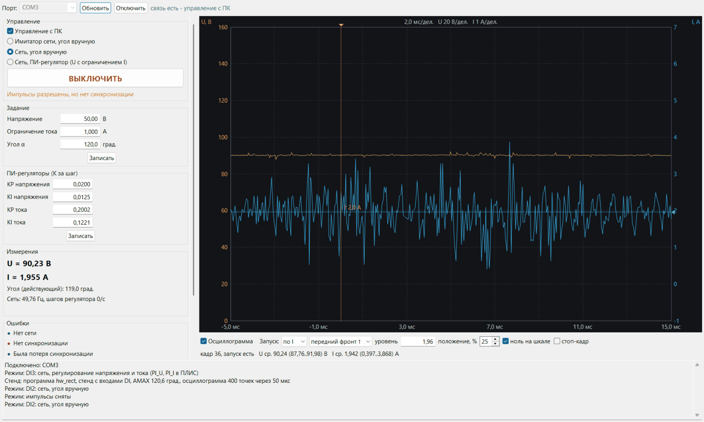
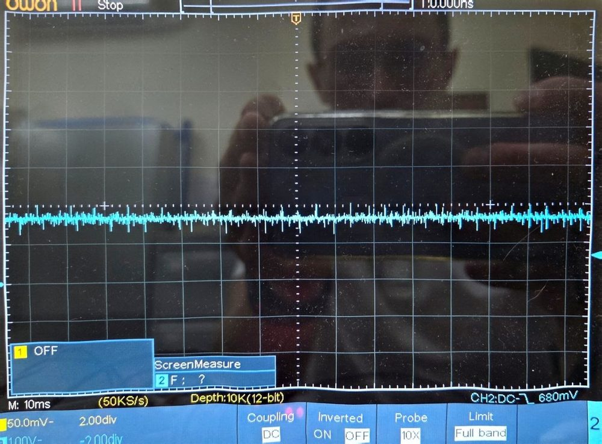
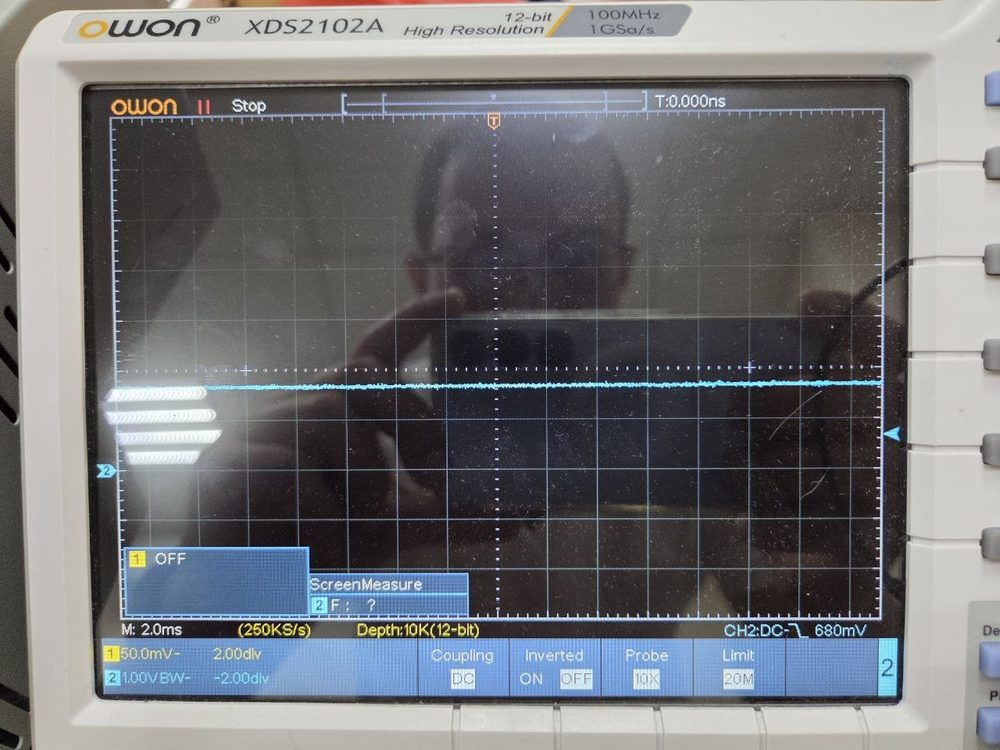
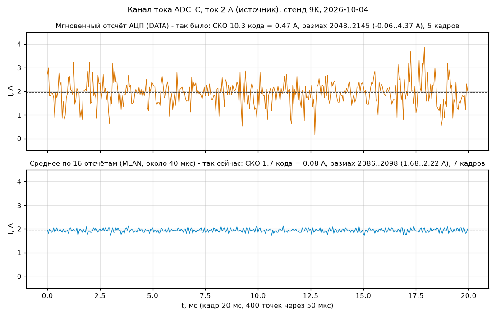
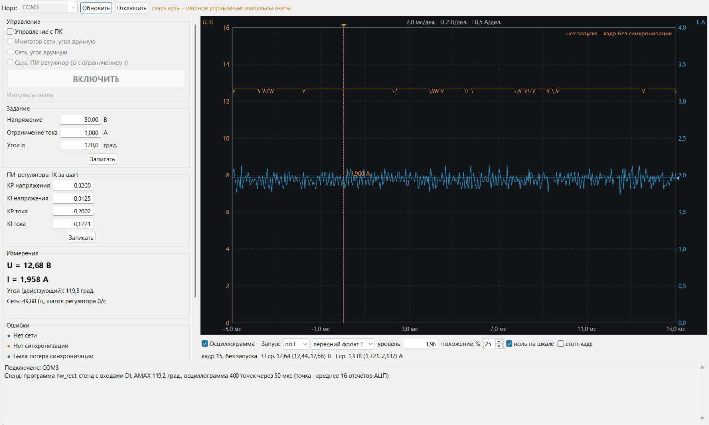

Пульт выпрямителя: управление по UART из Eclipse
=================================================

**Пульт выпрямителя** — панель Eclipse (плагин `ru.askorv32.rectgui`, исходники — [sw/rectgui](../../sw/rectgui/README.md)) для управления выпрямителем ([rectifier.md](rectifier.md)) с ПК по UART. Работает с программой обеих веток: `hw_rect` (регулятор в ПЛИС) и `fw_rect` (регулятор программой). Протокол один и тот же.

Что есть на панели:
- **Управление**: «Управление с ПК»; режим — имитатор сети и угол вручную, сеть и угол вручную, сеть и ПИ-регулятор; кнопка ВКЛЮЧИТЬ/ВЫКЛЮЧИТЬ импульсы; состояние импульсов.
- **Задание**: напряжение, ограничение тока, угол α для ручных режимов; кнопка «Записать».
- **ПИ-регуляторы**: KP, KI регуляторов напряжения и тока (K за шаг; в стенд уходит K · 4096); кнопка «Записать».
- **Измерения**: U, I (среднее за 0,5 с), действующий угол, частота сети, шагов регулятора в секунду, состояние регулятора (стабилизация напряжения / ограничение тока / стоит).
- **Ошибки**: лампы битов ошибок (таблица ниже) и кнопка «Сбросить защёлкнутые».
- **Осциллограмма U и I**: кадр 20 мс (период сети) раз в секунду; точка — среднее 16 отсчётов АЦП ([шум сигнала тока](#шум-сигнала-тока)). Запуск по переднему или заднему фронту U или I на заданном уровне либо без запуска. Положение запуска в кадре задаётся в процентах; линии уровня и положения можно перетаскивать мышью. Шкалы подбираются сами (шаг 1-2-5, по желанию с нулём); есть стоп-кадр, среднее/мин./макс. за кадр.
- **Журнал**: строки терминала стенда (смена режима, сообщения плат АЦП) и ошибки связи.

## Установка и запуск

```
py sw/rectgui/build.py
```

Получается `sw/rectgui/build/askorv32-rectgui-repo.zip`. В Eclipse: Help > Install New Software > Add > Archive… > этот архив > категория «askoRV32 - пульт выпрямителя» > Next > Finish, затем перезапуск. Уже установленный пульт обновляют через Help > Check for Updates: Install New Software с новой версией остановится на странице Install Remediation Page (там — «Update my installation…»). Нужен Eclipse с CDT (Eclipse Embedded CDT): COM-порт открывается пакетом `org.eclipse.cdt.native.serial`.

Панель открывается кнопкой на панели инструментов (значок с полуволнами) или через Window > Show View > Other > askoRV32 > Пульт выпрямителя. Дальше:
1. выбрать порт (UART платы; на стенде 9K — COM3) и нажать «Подключить»;
2. панель запросит сведения (`@I`: калибровку каналов, AMAX, размер кадра), включит осциллограмму и будет опрашивать состояние;
3. для управления — отметить «Управление с ПК».

Порт не должен быть занят другой программой, в том числе терминалом Eclipse. Последний порт и настройки осциллограммы панель запоминает.

## Управление с ПК и местное управление

| | Режим и импульсы | Задание, коэффициенты |
|---|---|---|
| **Местное** (по умолчанию) | стенд: DI1..DI3; без входов: команда терминала `m` | кнопки TM1638, терминал, пульт |
| **С ПК** («Управление с ПК», `@R 1`) | только пульт (`@M`, `@E`); входы DI не действуют | то же |

- **Перехват без удара.** Если в момент перехвата шли импульсы в режиме 1..3, пульт продолжает этот режим и импульсы не прерываются.
- **Смена режима** — как и по DI: импульсы снимаются на 40 мс, регулятор начинает с нуля (угол 120°).
- **Возврат к местному управлению.** Пульт отключили («Отключить» шлёт `@O 0`, `@R 0`) или он молчит 3 с — управление снова местное, осциллограмма выключается. Если на стенде включён вход DI, его режим сразу продолжается.
- **Светодиод 7 TM1638** — управление с ПК.

## Протокол

UART 115200 8-N-1, текст cp1251, строки заканчиваются CR (LF после CR пропускается).

- **Команда пульта** — строка, начинающаяся с `@`. Эха нет, на каждую команду — ровно одна строка ответа: `#S` (состояние, после любой исполненной команды), `#I` (на `@I`) или `#E <команда>` (не понял или недопустимое значение).
- **Следующая команда** уходит после ответа на предыдущую или через 0,6 с: так приём стенда (FIFO 16 байт и кольцо 128 байт) не переполняется.
- **Кадры осциллограммы** стенд шлёт сам.
- **Строки без `@`** — терминал, как раньше: эхо, `status()` и приглашение `> `. Пульт строку, начатую с `> `, читает без приглашения.

### Команды

| Команда | Действие |
|---|---|
| `@S` | состояние (пульт шлёт её раз в 0,3 с, когда очередь пуста, — это и признак связи) |
| `@I` | сведения: `#I fw=<ветка> io amax n dt avg vs vo cs co` |
| `@R 0\|1` | управление с ПК: выкл. / вкл. |
| `@M 1\|2\|3` | режим пульта: 1 — имитатор и угол, 2 — сеть и угол, 3 — сеть и ПИ-регулятор |
| `@E 0\|1` | импульсы: выкл. / вкл. (только при `@R 1`) |
| `@U <мВ>` | задание напряжения, 0..2 000 000 |
| `@L <мА>` | ограничение тока, 0..1 000 000 |
| `@A <0,1 град.>` | угол для ручных режимов, 0..1800 (больше AMAX — AMAX) |
| `@KU <KP> <KI>` | коэффициенты регулятора напряжения, K · 4096, 0..65535 |
| `@KI <KP> <KI>` | коэффициенты регулятора тока |
| `@T <ист.> <фронт> <уровень> <до запуска>` | запуск осциллограммы: источник 0 — U, 1 — I; фронт 0 — передний, 1 — задний, 2 — без запуска; уровень — код АЦП 0..4095; точек до запуска 0..n−1 |
| `@O 0\|1` | осциллограмма: выкл. / вкл. (кадр раз в секунду) |
| `@X` | сбросить защёлкнутые ошибки |

### Состояние `#S`

Поля `ключ=значение` (десятичные). Пульт пропускает незнакомые поля и обходится без отсутствующих.

| Поле | Значение |
|---|---|
| `m` | действующий режим: 0 — импульсы сняты, 1 — имитатор и угол, 2 — сеть и угол, 3 — сеть и регулирование, 4 — несколько DI |
| `r`, `pm`, `on` | управление с ПК, режим пульта, импульсы пульта |
| `en`, `run` | импульсы разрешены (SIFU CR.EN); импульсы идут (EN, сеть есть, синхронизация есть) |
| `cc` | ограничение тока (режим 3) |
| `err` | биты ошибок (ниже) |
| `di` | входы DI1..DI3 (биты 0..2) |
| `u`, `i` | напряжение, мВ, и ток, мА: среднее окон за 0,5 с |
| `us`, `il` | задание напряжения, мВ; ограничение тока, мА |
| `a`, `ae` | угол ручных режимов и действующий угол СИФУ, 0,1 град. |
| `kpu`, `kiu`, `kpi`, `kii` | коэффициенты, K · 4096 |
| `f` | частота сети, 0,01 Гц (0 — нет) |
| `st` | шагов регулятора за последнюю секунду |
| `ou`, `oi` | выходы регуляторов напряжения и тока, тиков угла |
| `sc` | осциллограмма включена |

### Биты ошибок (`err`)

| Бит | Ошибка | Вид |
|---|---|---|
| 0 | нет сети (SIFU SR.GRID = 0) | текущая |
| 1 | нет синхронизации (SR.LOST) | текущая |
| 2 | была потеря синхронизации (SR.LOSSF) | защёлка |
| 3 | плата напряжения: ошибка кадра или перезапуск преобразований | защёлка |
| 4 | плата тока: то же | защёлка |
| 5 | вход CMP платы напряжения (сейчас или был) | текущая + защёлка |
| 6 | вход CMP платы тока — защита по мгновенному току (сейчас или был) | текущая + защёлка |
| 7 | включено несколько DI (только при местном управлении) | текущая |

Защёлки сбрасывает `@X`.

### Сведения `#I`

- `fw` — ветка программы (`hw_rect` или `fw_rect`);
- `io` — 1, если на стенде есть входы DI;
- `amax` — наибольший угол, 0,1 град.;
- `n` и `dt` — точек в кадре и шаг, мкс;
- `avg` — по скольким отсчётам АЦП усреднена точка (16);
- `vs`, `vo` и `cs`, `co` — пересчёт каналов напряжения и тока: величина = (код − `o`/1000) · `s`/10⁶ (`<канал>_SCALE_U`, `<канал>_OFFSET_M` из `soc.h`).

Пульт переводит по ним коды осциллограммы в вольты и амперы, а уровень запуска — обратно в код.

### Кадр осциллограммы

```
#W seq=12 n=400 dt=50 pre=100 trig=1 src=1 edge=0 lvl=2092 late=1
#D U 0 196195195197…        ← 50 точек: по 3 шестнадцатеричные цифры (код 0..4095)
#D U 50 …
…
#D C 350 …
```

- **Заголовок** `#W`:
  - `seq` — номер кадра;
  - `pre` — точка запуска (столько точек до неё);
  - `trig` — 1, если запуск был, 0 — кадр без запуска;
  - `src`, `edge`, `lvl` — настройки запуска;
  - `late` — наибольшее опоздание отсчёта при захвате, мкс (диагностика).
- **Строки** `#D <канал> <смещение> <данные>`: U, затем C (ток), по 50 точек, всего 16 строк.
- **Порядок отправки.** Стенд шлёт одну строку за проход главного цикла, между ними могут прийти `#S` и другие строки. Кадр готов, когда пришли все 2 · n точек; испорченная строка отбрасывает кадр.

## Захват осциллограммы (прошивка)

- **Точки.** Раз в секунду программа записывает точки обоих каналов в кольцо: 400 на канал через 50 мкс (20 тыс. точек/с). Точка — аппаратное среднее канала `MEAN` по 16 отсчётам (`AVG` = 4): около 40 мкс при 394 тыс. отсчётов/с на 9K, 34 мкс при 468 тыс. на 20K. Это фильтр перед прореживанием. Мгновенный отсчёт `DATA` для этого не годится: шум платы тока быстрый ([шум сигнала тока](#шум-сигнала-тока)). Средние за окно для регулятора (`WMEAN`) от `AVG` не зависят.
- **Запуск** — переход уровня `lvl` по фронту канала-источника с гистерезисом 16 кодов. Для переднего фронта нужно сначала опуститься до `lvl − 16`, потом подняться до `lvl`; для заднего — наоборот. До запуска в кольце должно накопиться не меньше `pre` точек, после запуска дописываются остальные n − 1 − `pre`.
- **Нет запуска.** Если за `pre` + 2n точек (около 45 мс) запуска нет, уходит кадр без запуска (`trig=0`, как режим AUTO осциллографа). Без запуска (`edge=2`) кадр — просто 20 мс подряд.
- **Длительность захвата** — 20..60 мс, ожидание — по счётчику `mtime`. Во время захвата и передачи программа продолжает:
  - принимать байты UART (кольцо 128 байт);
  - снимать средние окон.

  Поэтому в `fw_rect` шаги регулятора не теряются: `windows()` вызывается на каждой точке и при ожидании места в FIFO передачи.
- **Передача кадра** — около 2,6 кБайт, примерно 0,23 с при 115200, по строке за проход цикла. Вместе с состоянием 3 раза в секунду занято около трети пропускной способности UART.
- **Ресурсы:**
  - кольцо — 1,6 кБайт DMEM;
  - вся программа с пультом на Tang Nano 9K — 28,5 кБайт IMEM из 32 и 6,0 кБайт DMEM из 8.

## Шум сигнала тока

**Что было видно.** На первой версии осциллограммы пульта (точка — мгновенный отсчёт АЦП) ток 2 А от лабораторного источника выглядел полосой 0…4 А. При этом индикатор и `#S` показывали ровные 1,96 А — это среднее за 0,5 с.



### Осциллограммы на входе АЦП

Плата ADC_C, вход U4 (ADC121S051, вывод AIN) относительно земли C8. Осциллограф OWON XDS2102A, канал 2 — 1 В/дел., щуп ×10, ток 2 А.

| 10 мс/дел., 50 тыс. точек/с, полная полоса | 2 мс/дел., 250 тыс. точек/с, полоса 20 МГц |
|---|---|
|  |  |

При 1 В/дел. шум, который видит АЦП (СКО 8 мВ, размах около 80 мВ), — меньше десятой доли клетки. Поэтому линия на втором снимке в этом масштабе «чистая». Утолщение линии на первом снимке, вероятно, — наводка на щуп выше 20 МГц: на втором снимке её срезает ограничение полосы.

Чтобы увидеть шум уровня АЦП, нужно:
- 10–20 мВ/дел., вход AC (или DC со смещением −1,68 В), полоса 20 МГц;
- 5–10 мкс/дел.;
- короткая пружина земли щупа у C8.

### Осциллограммы с АЦП

Те же условия, кадры пульта: 400 точек через 50 мкс.



### Опыты на стенде 9K (2026-10-04)

Ток 2 А, по 5–7 кадров. Частоту отсчётов (регистр `PER`), SCLK и паузу между кадрами (`DIV`) меняли отладчиком на работающей программе.

| Режим АЦП канала тока | СКО, кодов | Размах, коды |
|---|---|---|
| как было: 394 тыс. отсчётов/с, SCLK 6,75 МГц, мгновенный отсчёт `DATA` | 10,3 | 2048…2145 |
| 100 тыс. отсчётов/с | 9,9 | 2038…2134 |
| 20 тыс. отсчётов/с | 10,6 | 2038…2148 |
| SCLK 3,4 МГц | 10,2 | 2048…2148 |
| пауза перед выборкой ×4 (QUIET 8) | 10,5 | 2052…2145 |
| **среднее `MEAN` по 16 отсчётам (так сейчас)** | **1,7** | 2086…2098 |
| для сравнения — канал напряжения, мгновенный отсчёт | 0,6…1,1 | — |

### Выводы

- **Связь с АЦП и частота измерений шум не создают.** Он не меняется ни с частотой отсчётов (20…394 тыс./с), ни с SCLK, ни с паузой перед выборкой; ошибок кадра нет. На плате напряжения с тем же АЦП и теми же изоляторами шум около 1 кода.
- **Шум быстрый, широкополосный — в аналоговом сигнале платы тока до АЦП.** Соседние точки не связаны. Среднее по 16 отсчётам (около 40 мкс) снижает его в 6 раз — больше, чем √16, значит, заметная доля лежит выше ~100 кГц.
- **Тракт чувствительный.** Шунт 0,1667 мОм × INA181A3 (×100) = 16,7 мВ/А. Один код на AIN — 0,8 мВ = 46 мА, 1 мкВ на шунте — 6 мА.
- **Регулятору и показу шум не мешает.** Они берут среднее за окно 60° (около 1300 отсчётов): шум падает до 0,3 кода.

### Подозрения по схеме платы (проверить)

1. **Опорное АЦП — его питание VA (+3V3 от LM1117, U9).** Середина шкалы INA181 (REF 1,65 В) берётся с делителя R14/R15 через C9 и LMV321. Быстрые пульсации +3V3 REF не повторяет и сокращения не даёт: 10 мВ пульсаций при коде около 2048 — ошибка около 6 кодов. Источник пульсаций — изолированный DC-DC U10 (AM1LS-0505S) с частотой в сотни кГц; LM1117 на таких частотах их почти не подавляет.
2. **Собственный шум INA181A3:** около 40 нВ/√Гц в полосе ~150 кГц, то есть около 2 мВ СКО на выходе — 2–3 кода. Фильтр R13/C8 (220 Ом × 1 нФ, срез ~720 кГц) полосу не ограничивает.
3. **Пульсации тока лабораторного источника и наводки на дорожки шунта** — их усилитель усиливает в 100 раз.

Что проверить:
- осциллографом 10 мВ/дел., вход AC: +3V3 на выводе 1 U4 и вход AIN — есть ли там пульсации 100–500 кГц и совпадают ли они;
- снять кадры при нулевом токе: шум остался — это питание или усилитель, пропал — источник.

Что можно сделать на плате:
- RC-фильтр питания VA, например 10 Ом + 10 мкФ, или отдельный малошумящий стабилизатор (LDO);
- C8 — 10 нФ (срез ~72 кГц);
- LC-фильтр после U10.

**Осциллограмма пульта сейчас** — точка как среднее по 16 отсчётам: ток 1,72…2,13 А при 2 А.



Шкала тока подстроилась сама (0,5 А/дел.). Запуска на постоянном токе нет: гистерезис 16 кодов больше оставшегося шума (около ±6 кодов), поэтому уходит кадр без запуска. На сигнале 50/300 Гц запуск работает как обычно.

## Проверка

Стенд 9K, 2026-10-04, ветка `hw_rect`, программа загружена отладчиком, режим DI3. Внешние источники: 90 В, 1,96 А; силовой мост не подключён; вход синхронизации CA стенда неисправен.

**Протокол** (терминальная проверка):
- `@I` и `@S` отвечают;
- `@R 1` перехватывает режим DI3 без удара (`pm=3 on=1`);
- `@M 2` даёт «DI2: сеть, угол вручную», `@E 0` — «импульсы сняты»;
- неизвестная команда даёт `#E`;
- `#S` между строками кадра не мешает.

**Осциллограмма:**
- запуск по току на уровне 2092 (около 1,96 А) работает по переднему и заднему фронту: отсчёт `pre` не ниже уровня при переднем фронте и не выше при заднем;
- на недостижимом уровне уходит кадр без запуска;
- опоздание отсчёта при захвате — 1 мкс.

**Панель** (запуск вне Eclipse на том же стенде):
- подключение, сведения, состояние, перехват управления, смена режима, ВЫКЛ/ВКЛ — без сети «импульсы разрешены, но нет синхронизации»;
- осциллограмма с запуском по I на 1,96 А («запуск есть»), лампы ошибок («нет синхронизации»), журнал строк стенда.

**Во flash стенда 9K** (2026-10-04) записаны конфигурация ПЛИС и программа `hw_rect` с пультом и средним по 16 отсчётам. Стенд стартует сам: `#I … avg=16`, шум тока на осциллограмме — СКО 1,7 кода.

**Ветка `fw_rect` на стенде 9K** (2026-10-04, ПЛИС и программа `fw_rect` во flash):
- `#I fw=fw_rect avg=16`; перехват управления, режимы, ВКЛ/ВЫКЛ, осциллограмма и панель — как в `hw_rect`;
- режим регулирования с имитатором сети, включённым на время проверки через отладчик, — 300 шагов программного регулятора в секунду и с осциллограммой, и без неё: при захвате и передаче кадра шаги не теряются, опоздание отсчёта — 1 мкс;
- задание с пульта: 100 В и 3 А при 90 В на входе — выход регулятора напряжения у предела, угол 0°; ограничение 1 А при токе 1,97 А — «ограничение тока», угол 120°.

Для 20K `fw_rect` проверена только сборкой.
