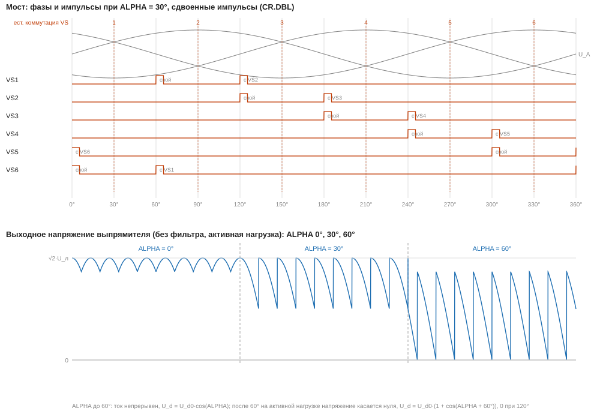
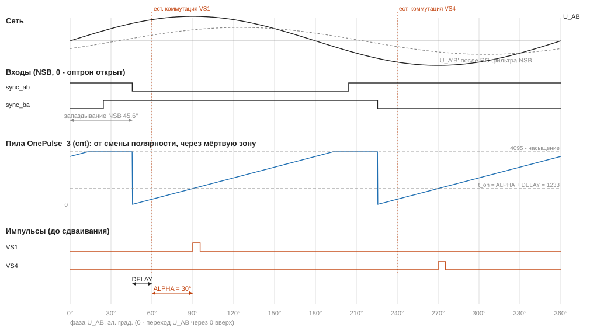

СИФУ — управление трёхфазным мостовым тиристорным выпрямителем
================================================================

**СИФУ** (система импульсно-фазового управления) выдаёт импульсы на шесть тиристоров трёхфазного мостового выпрямителя (VS1…VS6) с заданным углом управления α относительно точек естественной коммутации. Синхронизацию с сетью даёт плата **NSB** (шесть оптронов на линейных напряжениях). Это первый пользовательский модуль силовой электроники в askoRV32: перенос проекта стенда `test_nsb` (ветка `test_nsb`, `hw/Documents/test_nsb/src/top.v`) в периферию процессора. Структура та же — фильтры `filter_2bit`, генераторы пилы `OnePulse_3`, делитель `my_divider`, сдвиг `DELAY_RC_COMPENSATION`, — но угол, сдвиг, длительность импульса и делитель задаёт программа через регистры.

| Файл | Назначение |
|---|---|
| `sifu.sv` | `sifu_top` (регистры по шаблону `periph_regs`, сдвоенные импульсы, флаги), `my_divider`, `filter_2bit`, `OnePulse_3`, `sifu_simgen` (имитатор сети) |
| `tb_sifu.sv` | тест с моделью сети и NSB: `py hw/sim/run_periph_tests.py sifu` |
| `img/gen_diagrams.py` | временные диаграммы этого описания (`img/*.svg`) |
| `fw/Core/Inc/sifu.h`, `fw/Core/Src/sifu.c` | библиотека на Си |
| `fw/Core/Src/main.c`, `EXAMPLE 8` | пример: самопроверка с имитатором сети, угол с терминала |

## Выпрямитель и точки естественной коммутации

Мост из шести тиристоров: катодная группа VS1, VS3, VS5 (фазы A, B, C — к «плюсу» выхода) и анодная VS4, VS6, VS2 (фазы A, B, C — к «минусу»). Номер — порядок включения: VS1 → VS2 → … → VS6, через 60 эл. град. В любой момент ток ведут два тиристора — по одному из каждой группы, выходное напряжение — линейное напряжение этой пары фаз.

**Точка естественной коммутации** тиристора — момент, когда напряжение его фазы становится наибольшим (катодная группа) или наименьшим (анодная) из трёх: с этого момента он мог бы проводить, будь он диодом. Для VS1 это пересечение U_A и U_C (переход U_AC через 0 вверх), то есть **через 60° после перехода через 0 линейного напряжения U_AB**. Так для всех шести: точка естественной коммутации тиристора — через 60° после перехода через 0 «его» линейного напряжения:

| Тиристор | Фаза, группа | Линейное напряжение (оптрон NSB) | Полярность | Пара `OnePulse_3` |
|---|---|---|---|---|
| VS1 | A, катодная | U_AB > 0 (OUT_AB) | положительная | `p_ab`, `thyr_out1` |
| VS4 | A, анодная | U_BA > 0 (OUT_BA) | отрицательная | `p_ab`, `thyr_out2` |
| VS3 | B, катодная | U_BC > 0 (OUT_BC) | положительная | `p_bc`, `thyr_out1` |
| VS6 | B, анодная | U_CB > 0 (OUT_CB) | отрицательная | `p_bc`, `thyr_out2` |
| VS5 | C, катодная | U_CA > 0 (OUT_CA) | положительная | `p_ca`, `thyr_out1` |
| VS2 | C, анодная | U_AC > 0 (OUT_AC) | отрицательная | `p_ca`, `thyr_out2` |

**Угол управления α** — задержка импульса тиристора от его точки естественной коммутации. При α = 0 мост работает как диодный (наибольшее напряжение), с ростом α напряжение падает: при непрерывном токе U_d = U_d0·cos α, на активной нагрузке после 60° выходное напряжение начинает касаться нуля, U_d = U_d0·(1 + cos(α + 60°)) и при 120° становится нулём. Это и видно на осциллограмме стенда (α = 0°, 30°, 60°) и на диаграмме ниже.



## Плата синхронизации NSB

Фазы A, B, C через делители 3 × 150 кОм (последовательно-параллельно, 150 кОм на фазу) и конденсаторы 100 нФ в звезду образуют **RC-фильтр**: напряжения A′, B′, C′ на конденсаторах сглажены и **запаздывают** относительно сети. Между каждой парой A′–B′, B′–C′, C′–A′ — два встречно-параллельных оптрона TLP183 через 2 × 56 кОм: один открыт, когда линейное напряжение пары положительно и больше порога (около 1 мА через светодиод), другой — когда отрицательно. Выходы — открытый коллектор с подтяжкой 47 кОм к +5 В и 27 кОм на землю, конденсатор 1 нФ:

- оптрон закрыт — на выходе около 5·27/(47+27) ≈ **1,8 В** (логическая 1);
- оптрон открыт — около 0 (логический 0).

Значит, **0 на входе СИФУ — «линейное напряжение этой полярности есть»**. У перехода линейного напряжения через 0 оба оптрона пары закрыты — **мёртвая зона** (обе 1). Сеть есть, пока открыт хотя бы один из шести оптронов (у перехода одного линейного напряжения через 0 два других — у максимума).

**Уровни.** Высокий уровень NSB ≈ 1,8 В — для банков ПЛИС на 1,8 В (LVCMOS18). На Tang Nano 9K это банк 3 (выводы 79–86 и др.), на нём входы и стоят. В банке на 3,3 В (LVCMOS33, порог V_IH = 2,0 В) 1,8 В — не гарантированная единица: на Tang Primer 20K (банки 1,8 В на Dock не выведены) для работы с NSB нужно поднять уровень — например, заменить R46–R51 (27 кОм) на 68 кОм (≈ 2,95 В) или подтягивать выходы к 3,3 В.

**Запаздывание.** Окно оптрона начинается позже перехода линейного напряжения через 0 на запаздывание RC-фильтра плюс половину мёртвой зоны. На стенде вместе это ≈ 45,6°, и точка естественной коммутации (через 60° после перехода через 0) оказывается через **60° − 45,6° = 14,4° = 400 тиков** после начала окна — это и есть `DELAY_RC_COMPENSATION = 400`. Значение подобрано на стенде: при другой плате NSB, частоте сети или частоте пилы его нужно подобрать заново (регистр `DELAY`, в конфигураторе — «Сдвиг DELAY»).

## Как работает модуль



```
входы NSB ─┬─> [SIM: имитатор сети] ─> filter_2bit x6 ─> OnePulse_3 x3 ─> сдваивание ─> EN и «сеть есть» ─> vs1..vs6
           │                              ↑ отсчёт: тик ГПН (FLT=1)    ↑ пороги t_on, t_off (ALPHA + DELAY, + WIDTH)
           │                          my_divider: тик ГПН раз в DIV + 1 тактов clk_per
```

### 1. Делитель `my_divider` — тик ГПН

Пила (генератор пилообразного напряжения, ГПН) считает **тики**: один такт шины `clk_per` из каждых `DIV + 1`. При 45 МГц и `DIV = 89` — **500 кГц**, полупериод сети 50 Гц (10 мс) — 5000 тиков, 1° = 27,8 тика, 1 тик = 0,036°. В `test_nsb` делитель выдавал меандр 500 кГц (из 27 МГц), на котором работали счётчики; здесь вся схема работает на одном такте шины, тик — только разрешение счёта (без производного такта — проще временной анализ).

**Почему 500 кГц.** Пила 12-битная (0…4095). Импульс должен целиком уложиться в пилу: `ALPHA + DELAY + WIDTH ≤ 4094`. При 500 кГц, `DELAY = 400` и `WIDTH = 150` наибольший угол — 4094 − 550 = 3544 тика = **127,6°**, то есть 120° (3333 тика, «около 3500» вместе с запасом) укладываются, а `DELAY` от переполнения защищён. Полупериод при этом длиннее пилы (5000 > 4096) — это не мешает: пила **не переполняется, а останавливается на 4095**, и после этого импульсов в полуволне нет (в `test_nsb` счётчик переполнялся и мог дать второй импульс при маленьком угле и короткой мёртвой зоне). Другая частота пилы — настройка блока в конфигураторе (или регистр `DIV`): полупериод должен остаться меньше 8192 тиков (порог «нет синхронизации»), а угол 120° — уложиться в пилу; конфигуратор это проверяет.

### 2. Фильтры `filter_2bit`

Вход оптрона асинхронный и с дребезгом (помехи от переключения тиристоров). Каждый из шести входов проходит:
- **синхронизатор** из двух триггеров — сигнал приводится к такту `clk_per`;
- **реверсивный счётчик 0…3** с гистерезисом: в каждый отсчёт +1 при входе 1 и −1 при 0; выход становится 1, когда счётчик дошёл до 3, и 0 — когда дошёл до 0. Помеха короче трёх отсчётов на выход не проходит.

Отсчёт (`CR.FLT`): по тикам ГПН (по умолчанию, `FLT = 1`) — подавляются помехи до 3 тиков (6 мкс), задержка фронта — 3 тика (0,1°); или по каждому такту (`FLT = 0`, как в `test_nsb`) — помехи до 3 тактов (67 нс). Задержка фильтра входит в подобранный на стенде `DELAY` и на угол не влияет: и начало полуволны, и импульс отсчитываются от выхода фильтра.

### 3. Пила и импульсы `OnePulse_3`

Один модуль на пару фаз XY (AB, BC, CA) обслуживает два тиристора фазы X: `sync1` — оптрон положительной полуволны U_XY, `sync2` — отрицательной.

- **Полуволна** — открыт ровно один из двух оптронов. Пила `cnt` стоит в нуле в мёртвой зоне (закрыты оба) и в такт смены полярности (если мёртвой зоны нет), затем считает тики до 4095 и останавливается.
- **Пороги.** Пока пила стоит в нуле, пара берёт пороги `t_on = ALPHA + DELAY` и `t_off = t_on + WIDTH` (их сумму считает `sifu_top`). Угол, сдвиг и длительность, записанные программой посреди полуволны, действуют **со следующей полуволны** этой пары — у импульса не бывает «половины» старого и нового угла, лишнего или пропавшего импульса.
- **Импульс** начинается, когда пила дошла до `t_on`, и кончается на `t_off` или на 4095: длительность — ровно `WIDTH` тиков (если не обрезана концом пилы). Импульс идёт на выход той полярности, оптрон которой открыт: положительная полуволна — тиристор катодной группы (VS1, VS3, VS5), отрицательная — анодной (VS4, VS6, VS2). `t_on ≥ 4095` — импульса нет (так после сброса: `ALPHA = 4095`).
- Сравнения — на равенство (пила проходит каждое значение): дешевле сравнений «больше/меньше» на цепочке переноса.
- **Полупериод и потеря синхронизации.** Счётчик тиков от начала последней полуволны: при каждом начале его значение — время между двумя началами (у пары AB — регистр `HPER`, полупериод сети); дольше 8191 тика без начала полуволны — пара потеряла синхронизацию (`SR.LOST`).

Итог: фронт импульса тиристора — через `ALPHA + DELAY` тиков после начала окна его оптрона, то есть через `ALPHA` после точки естественной коммутации.

### 4. Сдвоенные импульсы

В мосту тиристор открывается, только если открыт и тиристор другой группы, через который замыкается ток. При непрерывном токе он уже открыт, а в **режиме прерывистого тока** (большой угол, малая нагрузка) — нет: ток успел прерваться. Поэтому каждый тиристор получает **два импульса**: свой и подтверждающий — вместе со следующим по порядку (через 60°): `VSk = d_k | d_(k+1)`, VS6 — вместе с VS1 (`CR.DBL`, после сброса включено; так было и в `test_nsb`).

### 5. Выходы и защита

Выходы `vs1…vs6` — через регистр (без «иголок»), `VSk = EN & GRID & (импульс)`:
- `CR.EN` — разрешение импульсов программой (после сброса 0);
- `SR.GRID` — сеть есть (открыт хотя бы один оптрон). Нет сети — импульсов нет сразу (в `test_nsb` это был сигнал `ENABLE`);
- пропала синхронизация пары (оптрон «залип») — её пила остановится на 4095, и импульсов у пары не будет; программа узнаёт об этом по `SR.LOST`, `SR.LOSSF` и прерыванию.

### 6. Имитатор сети `sifu_simgen`

Для проверки без силовой части и платы NSB (`CR.SIM = 1`): шесть сигналов оптронов генерируются внутри блока и подаются вместо входов. Период — шесть секторов по `SECT` тиков (60° каждый), мёртвая зона `DZ` тиков у каждого перехода через 0. Имитатор выдаёт сигналы так, как их выдаёт NSB: точка «естественной коммутации» — через `DELAY` после начала окна, поэтому `DELAY` не меняется. Его можно убрать из ПЛИС настройкой блока «Имитатор сети: нет» (`SIM_EN = 0`, около 130 ячеек меньше): тогда `CR.SIM` и `SIMCFG` читаются как 0.

## Подключение

Блок SIFU — в библиотеке конфигуратора ПЛИС (группа «Своя периферия»): окно адресов по умолчанию `0x1600_0000`, прерывание — источник PLIC (по порядку блоков). В проекте:

| Плата | Входы AB, BA, BC, CB, CA, AC | Выходы VS1…VS6 |
|---|---|---|
| Tang Nano 9K | 79, 80, 81, 82, 83, 84 (банк 3, 1,8 В) | 28, 29, 30, 31, 32, 33 (банк 2, 3,3 В) |
| Tang Primer 20K (Dock) | B12, C12, B13, A14, B14, A15 — PMOD J6, контакты 5–10 | L9, N8, N9, N7, N6, D11 — PMOD J5, контакты 5–10 |

На Tang Primer 20K это линии разъёма RGB-LCD, выведенные и на PMOD J5/J6 (без подключённого LCD свободны). На стенде `test_nsb` (Tang Nano 9K) входы стояли на 10, 11, 13–16 (там на плате светодиоды), выходы — на 25–30: в проекте эти выводы заняты GPIO (светодиоды) и TM1638; для стенда выводы переназначаются в конфигураторе (перетащить вывод на схеме).

| Параметр | По умолчанию | Смысл | Настройка блока в конфигураторе |
|---|---|---|---|
| `MEMORY_TYPE` | 0 | 1 — данные чтения на следующем такте (шина с BSRAM) | — |
| `DIV_INIT` | 89 | `DIV` после сброса | «Частота пилы» (`sawHz`, 500 кГц) — делитель считает генератор |
| `DELAY_INIT` | 400 | `DELAY` после сброса | «Сдвиг DELAY» (`delayTicks`) |
| `WIDTH_INIT` | 150 | `WIDTH` после сброса | «Импульс» (`pulseTicks`) |
| `SIM_EN` | 1 | есть имитатор сети | «Имитатор сети» (`sim`) |

| Порт | Смысл |
|---|---|
| `clk`, `rst` | такт и сброс шины периферии (`clk_per`, `rst_per`) |
| `Write`, `Addr`, `WData`, `RData` | шина регистров |
| `sync_ab`, `sync_ba`, `sync_bc`, `sync_cb`, `sync_ca`, `sync_ac` | выходы NSB OUT_AB…OUT_AC: 0 — оптрон открыт |
| `vs1` … `vs6` | импульсы на драйверы тиристоров: 1 — импульс |
| `irq` | запрос прерывания `(SYNCF & SIE) | (LOSSF & LIE)`, через регистр |

В `soc.h` конфигуратор пишет `SIFU_BASE`, указатель `SIFU`, `SIFU_DIV_DEFAULT`, `SIFU_SAW_HZ`, `SIFU_DELAY_DEFAULT`, `SIFU_WIDTH_DEFAULT`, `SIFU_SIM`, `PLIC_SRC_SIFU` и `PLIC_SIFU_IRQHandler`.

**Ресурсы** (Gowin, с имитатором): около 530 LUT + 75 ALU + 400 регистров. Tang Nano 9K: логика 6024 → 6660 из 8640, Fmax ядра 45,9 МГц при Place 0 (база без СИФУ — 48,5), 47,8 при Place 1. Tang Primer 20K: Fmax 66,8 МГц.

## Регистры

| Смещение | Имя | Доступ | Биты | Смысл |
|---|---|---|---|---|
| `0x00` | `CR` | чт./зап. | `[0] EN` | импульсы разрешены (после сброса 0) |
| | | | `[1] DBL` | сдвоенные импульсы (после сброса 1) |
| | | | `[2] SIM` | имитатор сети вместо входов NSB |
| | | | `[3] FLT` | фильтр входов по тикам ГПН (после сброса 1), 0 — по тактам |
| | | | `[4] SIE` | прерывание по началу полуволны |
| | | | `[5] LIE` | прерывание по потере синхронизации |
| `0x04` | `ALPHA` | чт./зап. | `[11:0]` | угол, тиков от точки естественной коммутации; после сброса 4095 — импульсов нет |
| `0x08` | `WIDTH` | чт./зап. | `[11:0]` | длительность импульса, тиков |
| `0x0C` | `DELAY` | чт./зап. | `[11:0]` | `DELAY_RC_COMPENSATION`, тиков |
| `0x10` | `DIV` | чт./зап. | `[15:0]` | тик ГПН раз в `DIV + 1` тактов `clk_per`; новое значение — с ближайшего тика |
| `0x14` | `SR` | чт., зап. 1 | `[5:0] SYNC` | входы после фильтра (1 — оптрон закрыт): 0 AB, 1 BA, 2 BC, 3 CB, 4 CA, 5 AC |
| | | | `[8] GRID` | сеть есть |
| | | | `[9] SYNCF` | началась полуволна (любой пары); сброс записью 1 |
| | | | `[10] LOSSF` | пропала синхронизация; сброс записью 1 |
| | | | `[11] LOST` | сейчас нет синхронизации (какая-то пара > 8191 тика без начала полуволны) |
| | | | `[18:16] CH` | номер тиристора (1…6), чья полуволна началась последней |
| `0x18` | `HPER` | чт. | `[15:0]` | полупериод сети, тиков (между двумя последними началами полуволн пары AB); после сброса и при потере — до 65535 |
| `0x1C`, `0x20`, `0x24` | `CNT1..3` | чт. | `[11:0]` | пилы пар AB/BA, BC/CB, CA/AC |
| `0x28` | `GATE` | чт. | `[5:0]` | выходы VS1…VS6 (бит 0 — VS1); `[13:8]` — импульсы пар до сдваивания и `EN` |
| `0x2C` | `SIMCFG` | чт./зап. | `[15:0] SECT`, `[27:16] DZ` | имитатор: тиков на 60° (после сброса 1667 — 50 Гц при 500 кГц), мёртвая зона (56 тиков = 2°) |

Запись с байтовыми стробами меняет только выбранные байты; разряды выше указанных при записи отбрасываются, при чтении — 0.

## Библиотека на Си (`sifu.h`)

| Функция | Действие |
|---|---|
| `SIFU_Init()` | `DIV`, `DELAY`, `WIDTH` — значения конфигуратора, `ALPHA = 4095` (импульсов нет), `CR = DBL | FLT`, флаги сброшены |
| `SIFU_Enable()`, `SIFU_Disable()` | `CR.EN` |
| `SIFU_SetAlpha(ticks)`, `SIFU_GetAlpha()` | угол в тиках; больше `SIFU_AlphaMax()` — ограничивается им |
| `SIFU_SetAlphaDeg10(deg10)`, `SIFU_GetAlphaDeg10()` | угол в десятых долях градуса (300 = 30,0°), пересчёт по измеренному полупериоду |
| `SIFU_AlphaMax()` | наибольший угол, тиков: `4094 − DELAY − WIDTH` |
| `SIFU_AlphaOff()` | `ALPHA = 4095` — снять импульсы, не трогая `EN` |
| `SIFU_SetDelay(ticks)`, `SIFU_SetWidth(ticks)`, `SIFU_DoublePulse(on)` | `DELAY`, `WIDTH`, `CR.DBL` |
| `SIFU_SawHz()`, `SIFU_HalfPeriod()`, `SIFU_GridFreq100()` | частота тиков; полупериод (измеренный или 50 Гц, пока синхронизации нет); частота сети в сотых долях Гц (0 — синхронизации нет) |
| `SIFU_Deg10ToTicks()`, `SIFU_TicksToDeg10()` | пересчёт угла |
| `SIFU_GridPresent()`, `SIFU_SyncLost()`, `SIFU_LastChannel()`, `SIFU_GetFlags()`, `SIFU_ClearFlags()`, `SIFU_GetGates()` | состояние, флаги, выходы |
| `SIFU_IT_Enable(SIFU_CR_SIE / SIFU_CR_LIE)`, `SIFU_IT_Disable()` | прерывания |
| `SIFU_SimStart(freq100, dz_deg10)`, `SIFU_SimStop()` | имитатор сети: частота (5000 = 50,00 Гц), мёртвая зона (20 = 2,0°) |

Угол в градусах пересчитывается по **измеренному** полупериоду (`HPER`): при 49 или 51 Гц 30° остаются 30°.

## Примеры

Выпрямитель с плавным пуском до 30°:

```c
#include "sifu.h"

SIFU_Init();
SIFU_SetAlphaDeg10(1200);                 //Начинаем со 120° - напряжение около 0
SIFU_Enable();
for (uint32_t a = 1200; a > 300; a -= 10) {
    SIFU_SetAlphaDeg10(a);                 //Пары возьмут угол с новой полуволны
    delay_ms(20);
}
```

Регулятор, синхронный с сетью — прерывание по началу каждой полуволны (6 раз за период, 300 Гц):

```c
__IRQ void PLIC_SIFU_IRQHandler(void) {
    uint32_t f = SIFU_GetFlags();
    SIFU_ClearFlags(f);
    if (f & SIFU_SR_LOSSF) SIFU_Disable();        //Пропала синхронизация - снять импульсы
    if (f & SIFU_SR_SYNCF) SIFU_SetAlpha(regulator_step(SIFU_LastChannel()));
    PLIC_Complete(PLIC_SRC_SIFU);
}

void rectifier_start(void) {
    SIFU_Init();
    SIFU_IT_Enable(SIFU_CR_SIE | SIFU_CR_LIE);
    PLIC_Init();
    PLIC_SetPriority(PLIC_SRC_SIFU, 1);
    PLIC_Enable(PLIC_SRC_SIFU);
    IRQ_Enable(MEI_IRQn);
    __enable_irq();
    SIFU_Enable();
}
```

**Пример 8** (`fw/Core/Src/main.c`, `#define EXAMPLE 8`): имитатор сети 50 Гц, при старте — самопроверка: для углов 0, 30, 60, 90, 120° программа по счётчику тактов `mcycle` измеряет у каждого тиристора задержку фронта импульса от начала его полуволны и длительность и сравнивает с `ALPHA + DELAY` и `WIDTH`; затем — угол и режимы с терминала (115200, cp1251): число — угол, `e` — EN, `d` — сдвоенные импульсы, `n` — входы NSB, `s` — имитатор, `t` — самопроверка. На TM1638 — угол, на его светодиодах — сеть, потеря синхронизации, EN, имитатор.

**Проверено на платах 2026-10-03** (обе — битовый поток в SRAM, программа через отладчик): Tang Nano 9K и Tang Primer 20K, самопроверка — 30 из 30 измерений: задержка совпала с `ALPHA + DELAY` с точностью ±1 тик (опрос регистров программой), длительность — 150 тиков; частота имитатора — 49,99 Гц (`HPER` = 5001); переключение на входы NSB без платы (выводы подтянуты к 1) — «сети нет», `LOST`, `LOSSF`; обратно на имитатор — синхронизация за один период.

## Тест (`tb_sifu.sv`)

Модель сети и NSB: линейные напряжения со сдвигом 120°, оптроны открыты вне мёртвой зоны у перехода через 0. Сеть «ускорена» (полупериод 9000 тактов, тик — 2 такта: 4500 тиков на полупериод). 92 проверки:
- значения после сброса, разрядность регистров, байтовая запись;
- `HPER`, `GRID`, `SYNCF` и его сброс, пила пары AB;
- у каждого из шести тиристоров: один импульс за период, фронт через `DELAY` (α = 0) и через `ALPHA + DELAY` (α = 1000 тиков) от начала полуволны на входе (плюс 3 тика фильтра), длительность `WIDTH`, порядок VS1 → … → VS6 через 60°;
- сдвоенные импульсы: по два на тиристор за период; `GATE`;
- угол за пределом пилы — импульсов нет; импульс обрезается на 4095;
- `ALPHA`, записанный посреди полуволны до импульса, не сдвигает его — новый угол со следующей полуволны;
- `EN = 0` — импульсов нет; `SYNCF`, `CH` и прерывание `SIE`; пропадание сети — `GRID = 0`, выходы в 0, через 8192 тика `LOST`, `LOSSF` и прерывание `LIE`;
- имитатор сети: `HPER = 3·SECT`, импульсы всех тиристоров через сектор;
- фильтр: помеха 2 тика при `FLT = 1` не перезапускает пилу, 4 такта при `FLT = 0` — перезапускает.

## Отличия от `test_nsb`

| `test_nsb` (top.v) | askoRV32 (`sifu.sv`) |
|---|---|
| угол `REG_DATA` — константа в коде | регистр `ALPHA`, задаёт программа; фиксируется на полуволну |
| `pulse = alfa + 150` — конец импульса | регистр `WIDTH` — длительность |
| `DELAY_RC_COMPENSATION` — `localparam` | регистр `DELAY` (по умолчанию — из конфигуратора) |
| `my_divider` — меандр 500 кГц, счётчики на нём | разрешение счёта на такте шины, делитель — регистр `DIV` |
| `filter_2bit` на 27 МГц, выход — защёлка | синхронизатор + счётчик по тикам или тактам, выход — регистр |
| пила переполняется (12 бит) | пила останавливается на 4095 — второго импульса быть не может |
| `ENABLE` — комбинационно от входов | `EN` программы и «сеть есть» после фильтров; выходы — через регистр |
| — | полупериод/частота сети, флаги, прерывания, имитатор сети |
